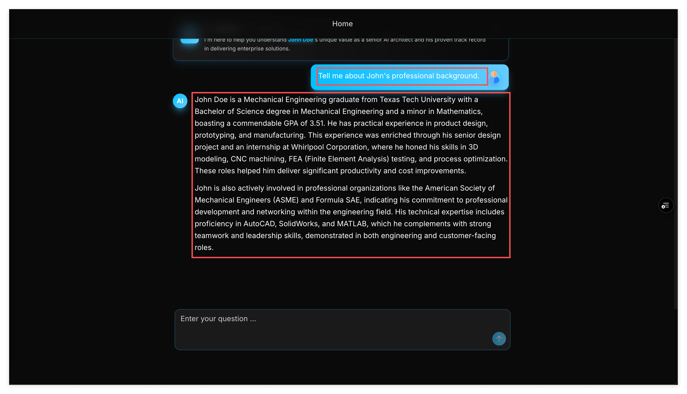
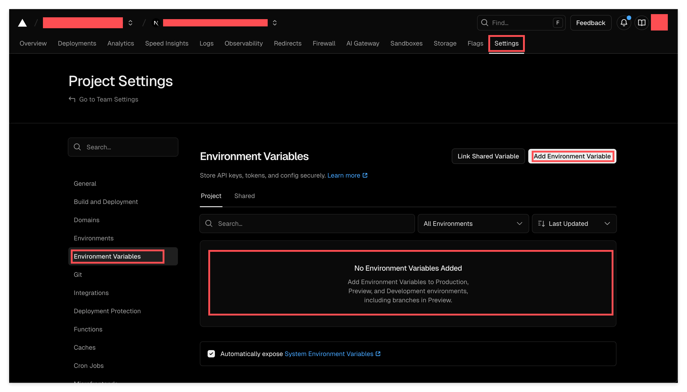
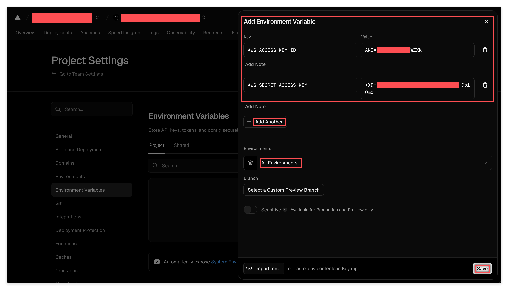
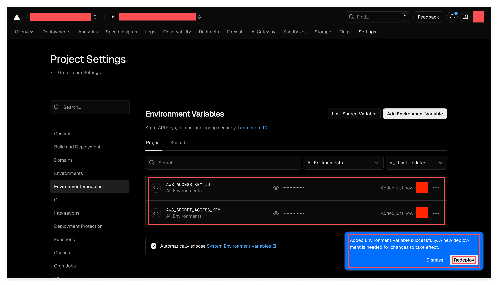

# 环境变量：从本地到云端

> 你的应用在本地跑得好好的——但云端怎么知道你的 AWS 密钥呢？



## 概述

上一课，我们把 AWS Bedrock 集成到了 FastAPI 后端。在你的电脑上跑得很顺利。但问题来了——你的电脑上有 `~/.aws/credentials` 这个文件，Vercel 的服务器上可没有。

当你把代码部署到云端时，代码运行的环境完全不一样了。你本地的文件？云端没有。你精心配置的环境？云端也没有。

这时候就需要 **Environment Variables（环境变量）** 了。它是把配置信息——尤其是密钥这类敏感信息——传递给不同运行环境的标准方式。

## 学习目标

你已经在本地把东西跑通了。现在是时候让全世界都能用上它了。但部署不只是点个按钮那么简单——你需要理解代码是如何适应不同运行环境的。

完成本课后，你将能够：

1. **理解 Environment Variables** — 知道它是什么，为什么它是跨环境配置应用的标准方式
2. **部署到 Vercel** — 把 AWS 密钥配置成环境变量，让你的 AI 应用在云端跑起来
3. **编写环境感知代码** — 用 runtime detection 让代码在本地和云端表现不同

## 前置条件

- 完成了上一课（AI 聊天端点在本地能跑通）
- 有一个 Vercel 账号（免费版就够了）
- 项目已经连接到 GitHub 并关联到 Vercel

---

## 核心概念

### 1. 问题：本地 Runtime vs 云端 Runtime

当你在本地运行代码时，你的电脑上有：
- `~/.aws/credentials` 文件里存着你的 AWS 密钥
- 你花时间配置好的各种环境
- 日积月累装上的各种文件和配置

当你的代码在 Vercel 上运行时，那边有：
- 一个全新的、空的容器
- 完全访问不到你本地的文件
- 根本不知道你是谁，也不知道该用哪个 AWS 账号

这就是核心挑战：**同样的代码，需要在完全不同的环境里跑起来**。

### 2. 解决方案：Environment Variables

Environment Variables（环境变量）是存在于代码之外的键值对。你可以把它想象成一个配置层，夹在你的应用程序和运行环境之间。

关键的理解是：

- **同样的 key，不同的 value** — `AWS_ACCESS_KEY_ID` 这个变量在本地和 Vercel 上都可以存在，但里面的值可以不一样
- **key 可能不存在** — 你的本地电脑可能没有 `VERCEL` 这个变量，但 Vercel 的服务器上有
- **值是在运行时注入的** — 你的代码不会把密钥写死在里面，而是从环境中读取

这就是专业应用处理配置的方式。永远不要把密钥写死在代码里。永远从环境变量读取。

想深入了解的话，可以读一读官方文档：
- [Vercel Environment Variables](https://vercel.com/docs/environment-variables)
- [System Environment Variables](https://vercel.com/docs/environment-variables/system-environment-variables) — Vercel 会自动设置一些变量，比如 `VERCEL`，你的代码可以用它来判断自己是不是在 Vercel 上运行

### 3. 检测运行环境

代码怎么知道自己是在本地运行还是在 Vercel 上运行呢？检查 `VERCEL` 这个环境变量就行了：

```python
import os

if os.environ.get("VERCEL") == "1":
    print("正在 Vercel 上运行")
else:
    print("正在本地运行")
```

Vercel 会在它的服务器上自动设置 `VERCEL=1`。你的本地电脑没有这个变量（除非你自己设置）。这个简单的检查就能让代码根据环境调整行为。

来看看我们是怎么在 `learn_personal_portfolio_ai/runtime.py` 里实现的：

```python
class Runtime:
    @cached_property
    def name(self) -> str:
        if os.environ.get("VERCEL", "NOTHING") == "1":
            return RuntimeEnum.VERCEL.value
        else:
            return RuntimeEnum.LOCAL.value

    def is_local(self) -> bool:
        return self.name == RuntimeEnum.LOCAL.value

    def is_vercel(self) -> bool:
        return self.name == RuntimeEnum.VERCEL.value

runtime = Runtime()
```

**为什么要这样设计？** 这个 `Runtime` class 乍一看好像有点多余——为什么不直接用 `os.environ.get()` 呢？答案是：用起来更舒服。有了这个设计，代码库里任何地方都可以这样写：

```python
from learn_personal_portfolio_ai.runtime import runtime

if runtime.is_local():
    # 本地专用的逻辑
```

一次 import，一个对象，IDE 会自动补全所有方法。复杂的逻辑被封装在一个文件里，其他地方都干干净净。这是一个常见的模式：**一个地方麻烦，换来所有地方简洁**。

### 4. 环境感知的 AWS 配置

现在来看 `learn_personal_portfolio_ai/boto_ses.py`：

```python
from .runtime import runtime

if runtime.is_vercel():
    boto_ses = boto3.Session(
        region_name="us-east-1",
        aws_access_key_id=os.environ["AWS_ACCESS_KEY_ID"],
        aws_secret_access_key=os.environ["AWS_SECRET_ACCESS_KEY"],
    )
else:
    boto_ses = boto3.Session(region_name="us-east-1")
```

**这里发生了什么？**

- **在 Vercel 上：** 没有 `~/.aws/credentials` 文件，我们必须显式地从环境变量传入密钥。
- **在本地：** boto3 的默认凭证链会自动找到你的 `~/.aws/credentials`，不需要特别指定。

这就是环境感知代码。同一个文件，同样的逻辑，但它会根据运行环境自动调整。

### 5. Vercel 的环境：Production vs Preview

Vercel 有多个环境：

- **Production** — 你的正式部署，通常来自 `main` 分支
- **Preview** — 来自其他分支的部署（比如 `13-Env-Vars-and-Deployment`）

当你推送一个分支时，Vercel 会创建一个 Preview 部署，带有独特的 URL。这非常适合在合并到 production 之前测试。

环境变量可以限定到特定环境。在这节课里，我们把它们设置成 "All Environments"，这样 Production 和 Preview 都能用。

### 6. 关于 IAM 权限

你可能正在用之前课程里创建的 IAM User。学习阶段这样没问题。在真正的生产环境里，你应该遵循最小权限原则——只给应用真正需要的权限（在我们的场景里，只需要 `bedrock:InvokeModel`）。

IAM 最佳实践我们这里不展开讲，但当你构建真实应用时要记住这一点。

---

## 练习

### 练习 1：理解 Runtime Detection 代码

**目标：** 理解我们的代码是如何检测运行环境的。

阅读这两个文件：
1. `learn_personal_portfolio_ai/runtime.py`
2. `learn_personal_portfolio_ai/boto_ses.py`

回答这些问题：
- [ ] 在 Vercel 服务器上，`os.environ.get("VERCEL")` 返回什么值？
- [ ] 为什么 `boto_ses.py` 在 Vercel 上需要显式传入密钥，而本地不需要？
- [ ] 用 `Runtime` class 模式相比到处直接用 `os.environ.get()` 有什么好处？

### 练习 2：在 Vercel 上配置环境变量

**目标：** 在 Vercel dashboard 里设置 AWS 密钥。

**步骤 1：** 进入 Vercel 项目的 Settings



导航到 **Settings** → **Environment Variables**。如果是第一次来，你会看到一个空列表。

**步骤 2：** 添加你的 AWS 密钥

点击 "Add Environment Variable"，添加两个变量：



- `AWS_ACCESS_KEY_ID` — 你的 IAM user 的 access key
- `AWS_SECRET_ACCESS_KEY` — 你的 IAM user 的 secret key

把范围设置成 "All Environments"，这样 Production 和 Preview 都能访问。

**步骤 3：** 保存，注意 redeploy 提示



保存后，你会看到变量列表。注意右下角的提示：**"A new deployment is needed for changes to take effect."**

> **为什么要重新部署？** 环境变量是在部署启动时注入的。如果你只改了环境变量（代码没变），Vercel 不会自动重新部署。你需要点 "Redeploy" 或者推送一个新的 commit 来让新的值生效。

### 练习 3：部署并验证

**目标：** 确认你的 AI 聊天在 Vercel 上能正常工作。

1. 把代码推送到 GitHub（如果还没推的话）
2. Vercel 会自动为你的分支创建一个 Preview 部署
3. 等待部署完成
4. 打开 Preview URL（类似 `your-project-git-branch-name.vercel.app`）
5. 测试聊天——发送一条消息，验证你收到了真正的 AI 回复

**提交内容：**

截一张你的聊天在 Preview 部署上正常工作的图。截图应该包含：
- 聊天界面，显示真正的 AI 回复（不是 "Hello Alice"）
- 浏览器地址栏，显示你的 Vercel Preview 域名

这能证明你的部署正在使用云端的密钥正常工作。

---

## 反思

今天学的东西看起来很简单：设置几个环境变量，部署，完事儿。

但背后的概念对专业软件开发来说是基础中的基础：

**你的代码永远不应该假设自己在哪里运行。** 本地电脑、测试服务器、生产云端——同样的代码应该在所有地方都能跑。环境变量就是让这成为可能的桥梁。

我们用的模式——检测环境，然后调整行为——在真实应用中到处都是：
- 开发/测试/生产环境用不同的数据库连接
- 不同环境用不同的日志级别
- 测试 vs 生产用不同的 API 端点

掌握这个模式，你就能把代码部署到任何地方。

---

## 导师寄语

**为什么这个练习很重要：**

今天的课可能感觉像是"只是配置一下"。但理解环境变量是开发者的一个成人礼。从这一刻起，你不再只是想"我的代码在我的电脑上"，而是开始想"我的代码在任何地方运行"。

每个专业代码库都用环境变量。每个 CI/CD 流水线都注入它们。每个云平台都管理它们。这不只是 Vercel 的事——这就是软件工作的方式。

**更深的道理：**

注意我们是怎么组织代码的。`runtime.py` 文件包含了所有环境检测的复杂逻辑。`boto_ses.py` 文件用一个简单的 `if runtime.is_vercel()` 就调用它了。这是刻意的设计。

当你构建软件时，永远要问："这个复杂的东西应该放在哪里？"答案通常是："放在一个地方，让其他所有地方都保持简单。"

一个文件处理乱七八糟的环境检测逻辑。其他所有文件只需要问一句 `runtime.is_vercel()` 就能拿到一个干净的布尔值答案。这就是保持大型代码库可维护的方法。

---

## 快速参考

**关键文件：**
- `learn_personal_portfolio_ai/runtime.py` — Runtime 环境检测
- `learn_personal_portfolio_ai/boto_ses.py` — 环境感知的 AWS 配置

**检查是否在 Vercel 上运行：**
```python
from learn_personal_portfolio_ai.runtime import runtime

if runtime.is_vercel():
    # 云端专用代码
```

**Vercel 文档：**
- [Environment Variables](https://vercel.com/docs/environment-variables)
- [System Environment Variables](https://vercel.com/docs/environment-variables/system-environment-variables)

**Vercel 上需要的环境变量：**
- `AWS_ACCESS_KEY_ID`
- `AWS_SECRET_ACCESS_KEY`
