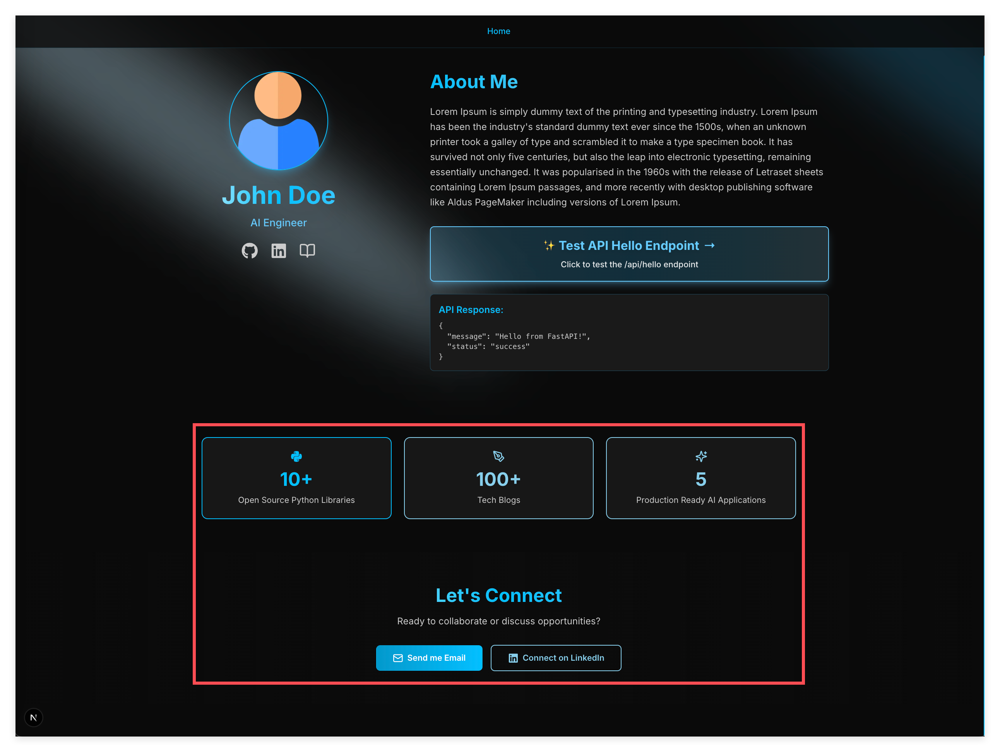
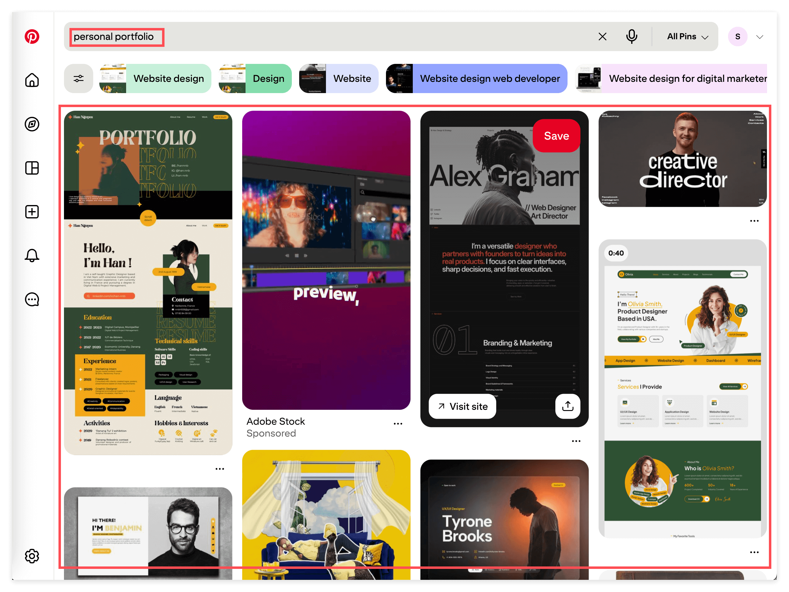

# AI 辅助编程：添加卡片组件与个人信息展示

> 学习如何在 AI 辅助下为 personal portfolio 网站添加自定义 UI 组件。



## Overview

你已经学会了如何探索代码库、找到 UI 元素对应的源码。现在，是时候亲手创造一些东西了。

但这不是传统意义上的"写代码"——在 AI 时代，编程的核心技能变了。不再是记住语法、背诵 API，而是**学会如何清晰地向 AI 描述你想要什么**。

这节课，你会体验一种全新的工作方式：**看到喜欢的设计 → 描述给 AI → 让 AI 帮你实现 → 理解代码如何工作**。这个技能将陪伴你整个职业生涯。

**关于技术栈：** 这个项目使用 React 组件和 Tailwind CSS。如果你不知道这些是什么，没关系——我们采用**先动手，后理解**的学习方式。先把东西做出来，看到效果，然后再回头理解原理。详细的概念介绍放在练习之后。

## Learning Objectives

为什么这很重要？

当你浏览其他人的 portfolio 网站时，你会看到很多炫酷的设计——渐变按钮、悬浮卡片、动态图标。以前，你需要花几周时间学习 CSS 和 React 才能实现这些效果。现在，有了 AI，几分钟就能完成。

但关键不是"让 AI 帮你写代码"这么简单。关键是：

1. **你要能描述清楚你想要什么** — 模糊的描述只会得到模糊的结果
2. **你要能理解 AI 给你的代码** — 不理解就无法调试、修改、扩展
3. **你要能把学到的知识迁移到新场景** — 这才是真正的学习

这三点，才是 AI 时代最重要的编程技能。

完成这节课后，你将：

1. 学会如何从设计灵感到代码实现的完整流程
2. 理解 React 组件和 Tailwind CSS 的基本工作原理
3. 掌握向 AI 提需求的正确姿势——提供充足的 context
4. 能够独立为自己的 portfolio 添加新的 UI 元素

## Prerequisites

- 你已完成前面的教程，能运行 `mise run dev`
- 浏览器可以访问 http://localhost:3000
- 你有一个 AI assistant (Claude, ChatGPT 等)

## What You'll Build

你将为 personal portfolio 网站添加自己喜欢的 UI 效果。

可能是一个炫酷的按钮、一个卡片悬浮效果、一个图标动画——具体是什么，由你决定。

这节课的核心不是完成某个特定功能，而是**掌握从"我想要这个效果"到"代码跑起来了"的完整流程**。

---

## Key Concepts（简要版）

> 这里只做简单介绍，让你知道有这些东西。详细的概念讲解在练习之后，我们先动手！

### Context Engineering

**Context**（上下文）是和 AI 协作时最重要的技能。简单说，就是**给 AI 足够的背景信息**，让它能准确理解你的需求。

后面的练习会教你怎么做。

### React 组件

React 组件就是**可复用的 UI 模块**，像乐高积木一样可以拼装。

你会在代码里看到类似这样的东西：
```tsx
<Hero />
<StatsSection />
<ContactSection />
```

每一个都是一个组件。先知道这个概念就够了，详细介绍在后面。

### Tailwind CSS

Tailwind CSS 是一种**用 class 名直接写样式**的方式：
```tsx
<button className="bg-blue-500 p-2 rounded">
  点击我
</button>
```

`bg-blue-500` 是蓝色背景，`p-2` 是内边距，`rounded` 是圆角。先知道这个概念就够了。

---

## Exercises

### Exercise 1: 启动项目，观察现有组件

**Goal:** 熟悉项目当前的 UI 结构。

**What to do:**

1. 启动开发服务器：
   ```bash
   mise run dev
   ```

2. 打开 http://localhost:3000

3. 观察页面上的这些元素：
   - Hero section（头像、名字、简介）
   - Social icons（GitHub、LinkedIn、Blog 图标）
   - Stats cards（成就卡片 grid）
   - Contact section（联系按钮）

4. 用前一节课学的技能，尝试找到每个元素对应的代码文件。

**What you'll notice:**

页面由多个组件构成：
- `Hero.tsx` — 头像、名字、简介、社交图标
- `StatsSection.tsx` — 成就卡片 grid
- `ContactSection.tsx` — 联系区域

这些组件在 `HomePageContent.tsx` 中被组合使用。

> **Key insight:** 大的页面由小的组件拼装而成。理解这种结构，你就能知道该在哪里修改代码。

---

### Exercise 2: 寻找设计灵感

**Goal:** 找到你想添加到 portfolio 的 UI 效果。

**What to do:**

1. 打开 https://www.pinterest.com/（需要注册账号）

2. 搜索 "personal portfolio website"

3. 你会看到很多设计灵感：



4. 浏览设计图，找到一个你喜欢的**小元素**：
   - 一个有趣的按钮样式
   - 一个卡片的悬浮效果
   - 一个 skill bar 的设计
   - 一个 timeline 组件
   - 一个 icon 的动画效果

5. **截图保存**，把你喜欢的那个小部分圈出来

**Important:** 选择一个**小而具体**的元素，不要选整个页面。小元素更容易实现，更容易理解。

**What you'll notice:**

好的 portfolio 设计通常有这些共同点：
- 简洁的布局
- 吸引眼球的交互效果（悬浮、点击反馈）
- 一致的配色方案
- 适当的留白

> **Key insight:** 设计灵感要具体化。"我想让网站更好看"太模糊；"我想要这个按钮的渐变效果"可以执行。

---

### Exercise 3: 向 AI 描述你想要的效果

**Goal:** 学习如何清晰地向 AI 提需求。

**What to do:**

1. 打开你的 AI assistant (Claude, ChatGPT 等)

2. 使用以下 prompt 模板，把 `[...]` 替换成你的具体内容：

```
我想将这张图片中的 [具体描述你圈出的那个元素] 加入到我的 personal portfolio 网站。

【项目背景】
- 技术栈：Next.js + React + Tailwind CSS
- 我想把这个元素添加到 [具体位置，比如"Hero section 的社交图标下方"]
- 当前相关代码在 [文件路径，比如 app/(marketing)/_components/Hero.tsx]

【我想要的效果】
- 形状：[描述形状]
- 颜色：[描述颜色]
- 文字/图标：[描述内容]
- 交互效果：[比如悬浮时放大/变色]

【我的要求】
请使用对于新手最容易懂、代码量尽量少的方式实现。
完成基础的设计功能即可，不需要过于复杂。
请详细解释：
1. 改了哪些代码
2. 每段代码的作用是什么
3. 为什么这样写能实现这个效果
```

3. 把截图一起发给 AI

4. 仔细阅读 AI 的回复，确保你理解了每个步骤

**Example prompt:**

```
我想将这张图片中的"带图标的技能进度条"加入到我的 personal portfolio 网站。

【项目背景】
- 技术栈：Next.js + React + Tailwind CSS
- 我想把这个元素添加到 StatsSection 下方
- 当前相关代码在 app/(marketing)/HomePageContent.tsx

【我想要的效果】
- 每个进度条有一个技能名称和一个图标
- 进度条是渐变色的，从蓝色到紫色
- 鼠标悬浮时进度条会轻微发光

【我的要求】
请使用对于新手最容易懂、代码量尽量少的方式实现。
完成基础的设计功能即可，不需要过于复杂。
请详细解释：
1. 改了哪些代码
2. 每段代码的作用是什么
3. 为什么这样写能实现这个效果
```

> **Key insight:** 描述越具体，AI 给的代码越准确。如果结果不满意，补充更多 context 再问一次。

---

### Exercise 4: 应用代码并理解

**Goal:** 把 AI 给的代码加入项目，并理解它是如何工作的。

**What to do:**

1. **仔细阅读 AI 的解释**，不要急着复制代码

2. **确认修改位置**：AI 应该告诉你要修改哪个文件的哪个位置

3. **应用代码**：
   - 打开对应的文件
   - 按照 AI 的指示添加或修改代码
   - 保存文件

4. **查看效果**：刷新浏览器 http://localhost:3000

5. **理解代码**：如果有任何不理解的地方，问 AI：

```
你给的代码中，这一行是什么意思？
[粘贴那一行代码]
```

6. **使用 Git 查看改动**：
   ```bash
   git diff
   ```

   这会显示你修改了哪些文件、哪些行。

**What you'll notice:**

- 大多数 UI 效果只需要修改几十行代码
- Tailwind CSS 的 class 名通常很直观
- 组件的结构是嵌套的，大组件包含小组件

> **Key insight:** "先做再理解"比"完全理解再做"更有效。看到效果后再去理解代码，印象更深刻。

---

### Exercise 5: 微调和迭代

**Goal:** 学会根据效果微调代码。

**What to do:**

1. 看着浏览器中的效果，思考：
   - 颜色满意吗？
   - 大小合适吗？
   - 间距好看吗？
   - 交互效果自然吗？

2. 如果想调整，问 AI：

```
效果基本是我想要的，但我想做一些调整：
- [具体调整，比如"按钮颜色从蓝色改成绿色"]
- [具体调整，比如"悬浮时的放大效果减小一点"]

请告诉我需要修改代码的哪个部分。
```

3. 应用 AI 的建议，再次查看效果

4. 重复这个过程，直到满意为止

**Iteration tips:**

- 每次只改一件事，这样容易定位问题
- 保存每次满意的状态（可以用 Git commit）
- 不用追求完美，"差不多了"就行

> **Key insight:** 编程是一个迭代过程。没有人能一次写出完美的代码。调试和微调是正常的工作流程。

---

## Key Concepts（详细版）

> 现在你已经动手做了，回过头来理解这些概念会更有感觉。

### Context Engineering: AI 时代最重要的技能

**Context**（上下文）是什么？

想象你请朋友帮你做一件事。你不会只说"帮我做这个"，而是会告诉他：
- 背景是什么？
- 为什么要做？
- 现在有什么资源？
- 之前试过什么方法？

这些信息就是 context。人类天生会收集和理解 context，但 AI 需要你**明确地提供**。

**为什么 Context Engineering 这么重要？**

同样一个需求，不同的描述方式会得到完全不同的结果：

**糟糕的描述：**
```
帮我把卡片改成蓝色
```

AI 不知道：你在说哪个卡片？项目结构是什么？用的什么技术栈？

**好的描述：**
```
我在做 personal portfolio 网站，使用 React + Tailwind CSS。
卡片组件在 app/(marketing)/_components/StatsSection.tsx。
现在卡片背景是深色的，我想把它改成浅蓝色。
请告诉我应该修改哪里，改成什么代码。
```

看到区别了吗？好的描述包含：
- **项目背景**（我在做什么）
- **技术栈**（用什么工具）
- **具体位置**（代码在哪）
- **当前状态**（现在是什么样）
- **目标需求**（我想要什么）

这个技能不仅用于 AI 编程，也适用于你未来的工作沟通、团队协作、甚至日常生活中的问题解决。

### React 组件：可复用的 UI 模块

**什么是组件？用乐高来类比**

想象你在搭乐高。每个乐高积木都是一个独立的单元——你可以把它用在城堡上，也可以用在汽车上。

React 组件就是代码世界的乐高积木：

```tsx
// 这是一个"卡片"积木
function Card({ title, description }) {
  return (
    <div className="border rounded-lg p-4">
      <h3>{title}</h3>
      <p>{description}</p>
    </div>
  )
}
```

写一次，到处复用：

```tsx
<Card title="项目A" description="这是项目A的描述" />
<Card title="项目B" description="这是项目B的描述" />
<Card title="项目C" description="这是项目C的描述" />
```

**如何识别 React 组件？**

- 它是一个函数（function）
- 函数名是大写开头（如 `Card`、`Button`、`Hero`）
- 函数返回 JSX（看起来像 HTML 的东西）

**框架化思考：学习任何新组件的三个步骤**

1. **分类体系** — 先知道有哪些类型的组件（按钮、卡片、表单、布局...）
2. **建立概念** — 去组件库网站看看实际效果，点击、悬停、感受交互
3. **动手实践** — 先模仿（从 1 到 10），再创造（从 0 到 1）

**去哪里看组件效果？**

问 AI："有哪些优秀的 React 组件库网站？我想看看常见组件的效果。"

AI 会推荐一些网站，你可以去浏览 5-10 分钟，感受一下"组件"是什么样的。

> **注意：** 组件库这个话题可以讲一个月。这里你只需要理解**组件是什么**、**设计理念是什么**就够了。具体的组件 API、属性配置，需要时再查文档或问 AI。

### Tailwind CSS：用 class 直接写样式

传统 CSS 需要在单独的文件里写样式：

```css
/* styles.css */
.my-button {
  background-color: blue;
  padding: 10px;
  border-radius: 5px;
}
```

Tailwind CSS 让你直接在 HTML 里用 class 组合样式：

```tsx
<button className="bg-blue-500 p-2 rounded">
  点击我
</button>
```

每个 class 做一件事：
- `bg-blue-500` — 蓝色背景（50-900 共 9 个色阶）
- `text-white` — 白色文字
- `p-2` — 内边距
- `px-4` — 水平内边距
- `py-2` — 垂直内边距
- `m-4` — 外边距
- `rounded` — 圆角
- `shadow` — 阴影
- `hover:bg-blue-600` — 鼠标悬停时的效果
- `transition` — 过渡动画

**为什么用 Tailwind？**

1. **快** — 不用在文件之间跳转
2. **直观** — 看 class 名就知道效果
3. **一致性** — 提供统一的设计系统（颜色、间距、字号）
4. **响应式** — 轻松适配不同屏幕（`md:text-lg` 表示中等屏幕时用大字）

**常用的 Tailwind 类速查：**

布局：`flex`、`grid`、`justify-center`、`items-center`
间距：`p-4`、`m-4`、`space-x-4`、`gap-4`
尺寸：`w-full`、`h-screen`、`max-w-4xl`
颜色：`bg-blue-500`、`text-gray-700`、`border-gray-300`
文字：`text-xl`、`font-bold`、`text-center`
效果：`shadow`、`rounded`、`hover:scale-105`、`transition`

> **注意：** Tailwind CSS 也可以讲一个月。这里你只需要理解**它是什么**、**设计理念是什么**就够了。具体的 class 名，需要时查文档（https://tailwindcss.com/docs）或问 AI。

---

## Reflection: What Did We Learn?

完成这些练习后，你学会了：

**AI 辅助编程的完整流程：**
1. 找到设计灵感（具体化你想要什么）
2. 向 AI 描述需求（提供充足的 context）
3. 应用代码并理解（先做再学）
4. 迭代微调（小步快跑）

**Context Engineering 的核心要素：**
- 说明项目背景和技术栈
- 指出具体的文件位置
- 描述当前状态和目标状态
- 明确你的约束和要求

**React 和 Tailwind 的基本概念：**
- 组件是可复用的 UI 模块
- Tailwind 用 class 组合样式
- 大页面由小组件拼装而成

**最重要的是：**
- 你不需要记住所有代码——需要时问 AI
- 你需要能清晰描述你想要什么
- 你需要能理解 AI 给你的代码
- 这个技能适用于任何编程任务

---

## Mentor's Note

**为什么这个练习如此重要：**

我见过太多人这样学编程：看视频、记语法、背 API、做习题。学了很久，还是不会做东西。

真正的编程能力不是记忆，是**创造**——把脑子里的想法变成能运行的代码。

AI 改变了这个游戏。以前，从"想法"到"代码"需要几年的学习。现在，AI 帮你跨越了这道鸿沟。但 AI 不能替你做的是：

1. **知道自己想要什么** — 这需要你去看、去想、去选择
2. **清晰地表达需求** — 这需要你练习 context engineering
3. **理解代码为什么工作** — 这需要你追问、思考、验证

这三件事，才是 AI 时代的核心编程技能。

**Key insights:**

- **从模仿开始，不丢人。** 所有大师都是从模仿开始的。看到好的设计，想办法复现它，这是最好的学习方式。

- **完成比完美重要。** 一个"能用"的功能，比一个"完美但没做完"的功能有价值一万倍。先做出来，再慢慢改。

- **理解是渐进的。** 今天你可能只理解 50%，没关系。明天做另一个功能时，你会理解 60%。编程能力是这样一点点积累的。

- **深入学习可以持续很久。** 组件库、Tailwind CSS 这些话题，每个都可以学一个月。但现在，你只需要理解它们是什么、设计理念是什么。具体细节，在你需要的时候再深入。

**Next steps:**

1. 继续给你的 portfolio 添加新元素——每做一个，你的技能就提升一点
2. 尝试修改颜色、大小、间距——感受 Tailwind 的工作方式
3. 当你做了 3-5 个小功能后，回头看第一个，你会发现自己进步了多少

---

## Quick Reference

**启动开发服务器：**
```bash
mise run dev
```

**查看代码改动：**
```bash
git diff
```

**AI Prompt 模板：**
```
我想将这张图片中的 [元素描述] 加入到我的 personal portfolio 网站。

【项目背景】
- 技术栈：Next.js + React + Tailwind CSS
- 位置：[目标位置]
- 相关文件：[文件路径]

【效果描述】
- 形状：[...]
- 颜色：[...]
- 交互：[...]

【要求】
请用最简单的方式实现，并详细解释代码的作用。
```

**项目关键文件：**
- `app/(marketing)/HomePageContent.tsx` — 主页内容组装
- `app/(marketing)/_components/Hero.tsx` — 头像、名字、简介
- `app/(marketing)/_components/StatsSection.tsx` — 成就卡片
- `app/(marketing)/_components/ContactSection.tsx` — 联系区域
- `data/achievement-stats.ts` — 成就卡片数据

**设计灵感来源：**
- https://www.pinterest.com/ — 搜索 "personal portfolio website"
- https://dribbble.com/ — 高质量设计作品
- https://awwwards.com/ — 获奖网站设计

**Tailwind CSS 文档：**
- https://tailwindcss.com/docs — 官方文档，需要什么 class 就去查

---

## Reference Implementation

本教程对应 `07-Add-Card-Components-And-Profile-Display` branch。

确认环境正常：

```bash
git checkout 07-Add-Card-Components-And-Profile-Display
mise run inst
mise run dev
```

然后打开 http://localhost:3000 查看效果。
