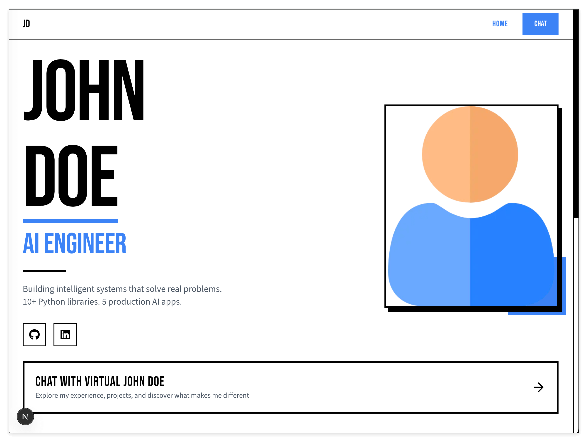
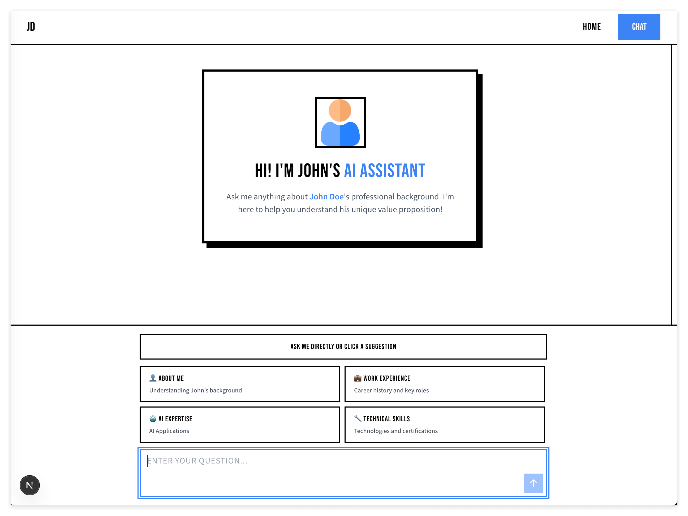

# Personal Branding: 让你的作品集与众不同

> 功能都有了，但看起来和别人的一模一样。是时候让它变成"你的"了。

## Overview

在前面的课程里，我们完成了一个完整的 AI 个人作品集网站：有静态的 Landing Page，有能和 HR 聊天的 AI Chatbot。功能上没问题。

但是，打开市面上任何一个 portfolio template，你会发现它们长得都差不多——同样的布局、同样的配色、同样的"千篇一律"。

这节课，我们要做一件事：**让这个网站真正变成"你的"**。

这不只是换个颜色那么简单。Personal branding 是你职业形象的一部分。当 HR 打开你的作品集时，第一眼的印象就决定了他们会不会继续往下看。

**看看改造后的效果：**

| Landing Page | Chat Page |
|--------------|-----------|
|  |  |

这是我们用 AI 改造后的效果——大胆的黑白配色、醒目的排版、独特的布局。你自己改完后，应该会有完全不一样的风格。

## Learning Objectives

为什么要学这个？

想象一下：你花了很多时间学技术、做项目、准备面试。但当你把作品集链接发给 HR 时，他们每天要看几十份简历，你的页面和别人的长得一样，凭什么让他们多停留几秒？

**Personal branding 不是可选项，而是必修课。**

在这节课里，你不只是学"怎么改 UI"，更重要的是学一种**解决开放式问题的思维模式**：

1. **先想（Think）** — 面对"让它更好看"这种模糊需求，先让 AI 帮你想方案，给你选项
2. **再做（Do）** — 选定方向后，让 AI 执行
3. **调试（Debug）** — 发现小问题，用自然语言描述，让 AI 修复

这个"想 → 做 → 调"的循环，适用于任何开放式问题。无论是设计 UI、写文案、还是规划架构，这都是一种非常强大的思维模式。

## Prerequisites

- 完成前面的课程（网站已部署，AI 聊天功能正常）
- 有基本的 Claude Code 使用经验

---

## Key Concepts

### 1. 什么是 Agent Skill？

在 Claude Code 里，我们可以给 AI 加载额外的"技能"。就像给 AI 装了一个专业插件。

当你输入 `/ui-ux-pro-max` 这样的 slash command 时，AI 会加载一套专门针对 UI/UX 设计的知识和流程。它不再是一个"什么都知道一点"的通才，而是变成了一个专精 UI 设计的专家。

**为什么这很重要？**

普通的 AI 可能会给你一些泛泛的建议。但加载了 UI/UX skill 之后，它会用专业设计师的思维来分析你的需求——考虑配色理论、排版原则、用户体验细节。

这就是 Agent Skill 的价值：**让 AI 在特定领域变得更专业**。

### 2. 先想再做：开放式问题的解决之道

"让这个网站更好看"——这是一个非常开放的需求。你可以有无数种方向：

- 换成暗色主题？
- 加入动画效果？
- 改成极简风格？
- 用更大胆的配色？

如果直接让 AI "帮我改好看一点"，结果可能完全不是你想要的。

**正确的做法是：先让 AI 想，给你选项，你来选。**

这个流程是：

1. 把你的需求和上下文告诉 AI
2. 明确说"先不要动手，给我几个方案"
3. AI 分析后给出几个方向
4. 你选一个，然后让 AI 执行

这样你始终掌控着方向，AI 负责执行。

### 3. 用自然语言调试

执行完后，你打开页面，可能会发现一些小问题。比如某个按钮 hover 时颜色不对，某段文字看不清楚。

这时候不需要你去翻代码、查 CSS。**直接用自然语言描述问题**：

> "这个按钮 hover 的时候整个变蓝了，灰色的副标题看不清楚。我觉得只要边框变蓝就好了。"

AI 会理解你的意图，找到对应的代码，然后修复它。

这就是 AI 时代的调试方式：**用人话说问题，让 AI 去改代码**。

### 4. 为什么是"现在"做 Personalization？

这是一个值得思考的问题：为什么不在一开始就做个性化设计？

**权衡的艺术：**

如果一开始就做个性化：
- 好处：后面所有功能都会按照这个风格来
- 坏处：网站框架还没出来，你很难想象最终效果。做出来后可能要返工。

如果等到现在做：
- 好处：基础功能已经完成，你能清楚看到网站长什么样，改起来更有针对性
- 坏处：可能需要调整一些已经写好的代码

**我们选择"现在"做，因为：**

1. 网站的核心功能已经完成，你能看到全貌
2. 但我们还会继续添加新功能，现在定下风格，后面的开发就有章可循
3. 这是一个"刚刚好"的时机——不太早（避免返工），不太晚（风格能贯穿后续开发）

这就是软件开发中的权衡——没有完美的时机，只有"当下最合适"的选择。

---

## Exercises

### Exercise 1: 让 AI 先想

**目标：** 学会用 Agent Skill 分析需求，获取设计方案。

**做法：**

1. 在 Claude Code 里输入以下 prompt：

```
/ui-ux-pro-max help me redesign my personal portfolio website - I need both layout AND visual design recommendations for the landing page (currently has hero, stats grid, contact sections arranged top-to-bottom), suggest 2-3 complete design directions where each option includes: a unique layout structure (like bento grid, asymmetric cards, sidebar profile, split-screen, or other modern patterns), color palette, typography pairing, and overall visual style - I want something that stands out from typical portfolio templates and makes a strong first impression on HR and hiring managers, brainstorm options first and don't code yet
```

2. **关键点：** 这个 prompt 要求 AI 同时考虑 **布局（layout）** 和 **视觉设计（visual design）**。你明确说了 "brainstorm options first and don't code yet"，这会让 AI 进入"分析模式"，给你几个完整的方案选择。

3. AI 会给出几个设计方向。仔细阅读每个方案，想想哪个更符合你想表达的个人风格。

**你会注意到：**

AI 不是随便给建议，而是基于你的具体情况（personal portfolio、给 HR 看、有 chatbot）来分析。这就是加载 UI/UX skill 的效果——它会像专业设计师一样思考。

### Exercise 2: 选定方案并执行

**目标：** 让 AI 执行你选定的设计方案。

**做法：**

1. 从上一步的方案中选一个你喜欢的（假设你喜欢 Option B）

2. 告诉 AI 执行：

```
I like Option B, please execute it.
```

3. AI 会开始修改代码。等它完成后，运行开发服务器查看效果：

```bash
mise run dev
```

4. 打开浏览器，看看变化。

**你会注意到：**

AI 会修改多个文件——可能是 CSS、可能是组件代码、可能是配置文件。你不需要知道每个文件的细节，只需要看最终效果是否符合预期。

### Exercise 3: 发现问题并修复

**目标：** 用自然语言描述问题，让 AI 修复。

**做法：**

假设你发现了一个问题：在 chat 页面，那些快捷按钮（"About Me"、"Work Experience" 等）hover 时整个按钮变蓝，导致灰色的副标题看不清楚。

1. 用自然语言描述问题：

```
one minor problem, on the chat page there are some shortcut button like "About Me", "Work Experience" when I move mouse to it, button becomes blue and gray subtitle is very hard to see, how me improve it
```

2. AI 可能会给你几个解决方案。如果你有更具体的想法，直接告诉它：

```
我觉得 hover 的时候, 边框变蓝就可以了, 不要整个 button 变蓝
```

3. AI 会修改对应的代码。刷新页面，确认问题已修复。

**你会注意到：**

你完全没有碰代码，只是用人话描述了问题和期望。AI 自己找到了 `multimodal-input.tsx` 文件，理解了 Tailwind CSS 的类名，然后做了精确的修改。

**这就是"想 → 做 → 调"的完整循环。**

### Exercise 4: 让 AI 教你它做了什么

**目标：** 不只是让 AI 改代码，还要理解它改了什么、为什么这么改。

**做法：**

改完之后，你应该问 AI 一个问题：

```
I'm satisfied with the result. Now tell me what you changed and why. Please explain each file you modified, one by one, so I can learn how to do this myself next time.
```

**为什么这一步很重要：**

如果你只是让 AI 改完就走，下次遇到类似问题，你还是不会。但如果你让 AI 解释：
- 改了哪些文件
- 每个文件里改了什么
- 为什么要这么改

你就能学到真正的知识。下次你甚至可以自己动手改。

**这才是 AI 辅助学习的正确姿势：让 AI 帮你做，然后让 AI 教你怎么做。**

---

## Reflection

在这节课里，我们做了一件看似简单的事：改了改 UI。

但真正重要的是背后的方法论：

1. **Agent Skill** — 让 AI 在特定领域更专业
2. **先想再做** — 面对开放式问题，先让 AI 给方案，你来选
3. **自然语言调试** — 用人话描述问题，让 AI 改代码

这个"想 → 做 → 调"的循环，不只适用于 UI 设计。任何开放式问题——写文案、设计架构、规划功能——都可以用这个模式。

**核心思想：你负责方向，AI 负责执行。**

---

## Mentor's Note

**为什么这节课很重要：**

很多同学觉得 personal branding 是"花哨的东西"，不如多学点技术实在。

但我想告诉你：在真实的求职市场里，第一印象非常重要。HR 每天要看几十份简历，你的作品集如果和别人长得一样，很可能连被打开的机会都没有。

**Personal branding 不是虚荣，而是竞争力的一部分。**

但这节课真正想教你的，不只是"怎么让网站好看"，而是一种**解决开放式问题的思维模式**：

1. 面对模糊需求，先让 AI 分析、给方案
2. 你来做选择、定方向
3. 让 AI 执行
4. 发现问题，用自然语言描述，让 AI 修复

这个模式，我在工作中每天都在用。无论是设计系统架构、写技术方案、还是做产品决策，"想 → 做 → 调"都是最高效的方式。

**关于时机的思考：**

你可能会问：为什么不一开始就做 personalization？

答案是：软件开发是一门权衡的艺术。

太早做，你不知道网站最终长什么样，改了可能要返工。太晚做，风格就很难统一了。我们选择"现在"——基础功能完成、但还会继续扩展的这个节点——是一个经过思考的决定。

记住：没有完美的时机，只有"当下最合适"的选择。学会做这种权衡，是成为资深工程师的必经之路。

---

## Quick Reference

**启动开发服务器：**
```bash
mise run dev
```

**"想 → 做 → 调 → 学"循环：**
1. 用 `/ui-ux-pro-max` 让 AI 分析需求，给出方案
2. 选定方案，让 AI 执行
3. 发现问题，用自然语言描述，让 AI 修复
4. 让 AI 解释它改了什么，学会自己做

---

### 文件变更总结

这次 UI 改造涉及以下文件，了解它们的作用能帮你理解整个网站的结构：

**全局样式与配置：**
- `app/globals.css` — 全局 CSS 变量、颜色系统（黑白主题 + 电光蓝强调色）、字体定义、工具类（bold-card、bold-button、bold-nav）、暗色模式
- `app/layout.tsx` — 根布局，引入字体（Bebas Neue 用于标题、Source Sans 3 用于正文）
- `tailwind.config.ts` — Tailwind 配置，定义颜色 tokens、字体、圆角、动画

**Landing Page 组件：**
- `app/(marketing)/HomePageContent.tsx` — 首页主体内容的组织，添加 Footer
- `app/(marketing)/_components/Hero.tsx` — 首页英雄区（split-screen 布局、大字排版、粗边框按钮）
- `app/(marketing)/_components/StatsSection.tsx` — 数据统计展示区（全宽边框分割布局）
- `app/(marketing)/_components/ContactSection.tsx` — 联系信息区（全宽边框分割布局）

**导航：**
- `app/_components/layouts/Navigation.tsx` — 顶部导航栏（简化设计、粗边框、Chat 入口）

**Chat 页面：**
- `app/chat/layout.tsx` — 聊天页面的布局结构、内边距调整
- `components/chat/chat.tsx` — 聊天主组件（消息列表、边框样式）
- `components/chat/message.tsx` — 单条消息的样式（头像、气泡、边框效果）
- `components/chat/multimodal-input.tsx` — 输入框和快捷按钮（粗边框、hover 反色效果）
- `components/chat/overview.tsx` — 聊天页的欢迎界面（上下文提示横幅）

---

## Homework

**截图你的成果：**

完成上面的练习后，截一张你网站的截图，放在这里。

这是你的 personal brand 的一部分。每次回顾这个项目，你都能看到自己亲手打造的独特设计。

---

*既然是个人品牌，就一定要非常非常 personalize。这节课教你的是方法，真正的 personalization 需要你自己去探索、去尝试、去打磨。*
