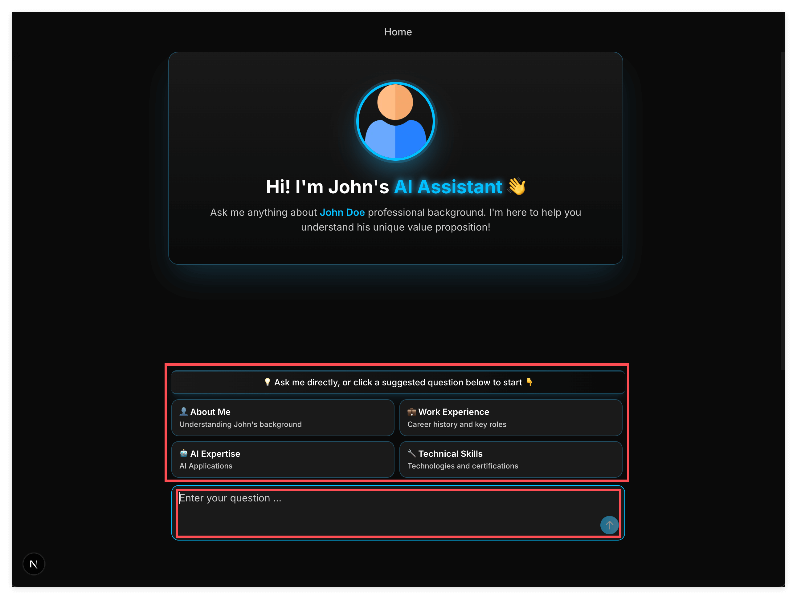

# Deep Dive into AI SDK and Stream Protocol

> No code writing—just thoroughly understand how ChatGPT-like chat applications work under the hood.



## Overview

In the last lesson, we got the chat feature "running," but you probably still have many questions:

- What exactly does the `useChat` hook do for us?
- Why does the AI's response appear one character at a time, instead of all at once?
- What data is actually being passed between frontend and backend?

Today, we won't write any code. We'll do just one thing: **read and understand code**.

This might sound strange—shouldn't learning to program mean writing more code? But the reality is, in actual work, you spend 70% of your time reading other people's code and only 30% writing. Moreover, many beginners can't write good code precisely because they haven't read enough good code.

Today, we'll "read" a production-level chat application.

## Learning Objectives

After completing this lesson, you will be able to:

1. **Understand import statements** — When you see `import { X } from "Y"`, know where to find X's definition
2. **Appreciate AI SDK's value** — Understand how much work the `useChat` hook saves you
3. **Master Stream Protocol fundamentals** — Understand the `text-start`, `text-delta`, `text-end` protocol
4. **Use DevTools to observe data flow** — See every byte transmitted between frontend and backend

## Prerequisites

- Completed the previous lesson, able to run `mise run dev` and access the chat page
- Have a browser (Chrome recommended)
- Have an AI assistant ready (Claude, ChatGPT, etc.) to help answer questions

## What You'll Learn

This is not a hands-on coding tutorial. You'll learn how to **understand** a real chat application:

- Trace code: From when the user clicks the send button to when the message appears on screen—what happens in between
- Understand protocols: How the "communication language" between frontend and backend is designed
- Build a global perspective: No longer get lost in the sea of imports

---

## Key Concepts

### Level 1: Understanding Import Statements

Many beginners get confused by `import` statements when reading code. File A imports file B, file B imports file C, and after jumping around, they're lost.

Actually, import statements only come in three forms. Master these and you'll never get lost:

#### Form 1: npm Packages (External Dependencies)

```tsx
import { useChat } from "@ai-sdk/react";
```

**Characteristic**: Path doesn't start with `.` or `/`, usually a package name.

**Where to find it**: `node_modules/@ai-sdk/react/` directory. But usually you don't need to look there—this is someone else's library, you just need to read its documentation.

**Analogy**: Like using a phone—you don't need to know how the chip is manufactured, just read the manual.

#### Form 2: Relative Paths (Same Project Files)

```tsx
import { PreviewMessage } from "./message";
```

**Characteristic**: Path starts with `.` (`./` means current directory, `../` means parent directory).

**Where to find it**: `message.tsx` (or `message.ts`, `message/index.tsx`) in the same directory as the current file.

**Analogy**: Like saying "the book on my desk"—it's described relative to "my position."

#### Form 3: Alias Paths (Project Convention)

```tsx
import { useScrollToBottom } from "@/hooks/use-scroll-to-bottom";
```

**Characteristic**: Path starts with `@/` (this is a Next.js project convention).

**Where to find it**: `hooks/use-scroll-to-bottom.ts` in the project root. `@/` is an alias for the project root.

**Analogy**: Like company desk numbers—"Section A, Row 3, Seat 5"—once you know the rule, you can find it.

#### Practical Exercise

Open [`components/chat/chat.tsx`](./components/chat/chat.tsx) and look at the import statements at the top:

```tsx
import { PreviewMessage, ThinkingMessage } from "./message";     // Form 2: message.tsx in same directory
import { MultimodalInput } from "./multimodal-input";            // Form 2: multimodal-input.tsx in same directory
import { Overview } from "./overview";                           // Form 2: overview.tsx in same directory
import { useScrollToBottom } from "@/hooks/use-scroll-to-bottom"; // Form 3: hooks/ in root directory
import { useChat } from "@ai-sdk/react";                         // Form 1: npm package
import { toast } from "sonner";                                  // Form 1: npm package
import { useState, useEffect, useRef } from "react";             // Form 1: npm package
import FingerprintJS from '@fingerprintjs/fingerprintjs';        // Form 1: npm package
```

Now you know: if you want to see how `PreviewMessage` is implemented, go to [`components/chat/message.tsx`](./components/chat/message.tsx); if you want to learn how to use `useChat`, check the [AI SDK official documentation](https://ai-sdk.dev/docs/ai-sdk-ui/overview).

---

### Level 2: AI SDK — Pre-built Wheels

Before discussing AI SDK, let's imagine: what would you need to implement yourself without AI SDK?

#### Without AI SDK, You'd Need To:

1. **Manage message state**
   ```tsx
   const [messages, setMessages] = useState([]);

   function addMessage(role, content) {
     setMessages(prev => [...prev, { role, content, id: Date.now() }]);
   }
   ```

2. **Send requests to the backend**
   ```tsx
   async function sendMessage(text) {
     const response = await fetch('/api/chat', {
       method: 'POST',
       headers: { 'Content-Type': 'application/json' },
       body: JSON.stringify({ messages: [...messages, { role: 'user', content: text }] })
     });
     // Then what? How to handle streaming responses?
   }
   ```

3. **Parse streaming responses (SSE)**
   ```tsx
   const reader = response.body.getReader();
   const decoder = new TextDecoder();

   while (true) {
     const { done, value } = await reader.read();
     if (done) break;

     const chunk = decoder.decode(value);
     // Parse "data: {...}\n\n" format
     // Handle text-start, text-delta, text-end...
     // Update UI...
   }
   ```

4. **Handle various edge cases**
   - What if the user sends a new message while AI is still responding?
   - What if the network disconnects?
   - What if the user clicks "stop generating"?

Just thinking about it is overwhelming. But all of this is handled by AI SDK's `useChat` hook.

#### With AI SDK, You Only Need:

Open [`components/chat/chat.tsx`](./components/chat/chat.tsx), find lines 128-156:

```tsx
const {
  messages,      // Array of all messages, auto-updates
  setMessages,   // Manually modify messages (rarely used)
  sendMessage,   // Function to send messages, one line does it
  status,        // Current status: "idle" | "submitted" | "streaming"
  stop,          // Function to stop AI generation
} = useChat({
  onError: (error) => {
    // Error handling
  },
});
```

That simple. One `useChat`, returns 5 things, covering all the functionality you need:

| Return Value | Purpose | How Much Code You'd Need |
|-------------|---------|-------------------------|
| `messages` | All messages, auto-updates | ~30 lines state management |
| `sendMessage` | Send messages | ~50 lines fetch + parsing logic |
| `status` | Current status | ~20 lines state tracking |
| `stop` | Stop generation | ~15 lines interrupt logic |

AI SDK saves you 100+ lines of code, and those 100 lines are extensively tested code that handles all kinds of edge cases.

#### How Does AI SDK Know Where to Send Requests?

You may have noticed `useChat()` doesn't specify an API address. So how does it know to send requests to `/api/chat`?

The answer is: **convention over configuration**. AI SDK defaults to sending to `/api/chat`. If you want to change it, you can pass an `api` parameter:

```tsx
useChat({ api: '/api/my-custom-chat' })
```

This "convention over configuration" design philosophy is very common in modern development. The benefit: in most cases, you don't need to configure anything—it just works.

---

### Level 3: Tracing Data Flow — From Button to Backend

Now, let's trace a complete data flow: user enters "hello" and clicks send, until the AI reply appears on screen.

#### Step 1: User Clicks Send

Open [`components/chat/multimodal-input.tsx`](./components/chat/multimodal-input.tsx), find the send button's click event. When the user clicks the button or presses Enter, it calls the `submitForm()` function, which ultimately calls `handleSubmit()`.

#### Step 2: handleSubmit Processing

Back to [`components/chat/chat.tsx`](./components/chat/chat.tsx), find lines 162-168:

```tsx
const handleSubmit = (e?: { preventDefault?: () => void }, options?: any) => {
  e?.preventDefault?.();
  if (input.trim()) {
    sendMessage({ text: input });  // Key! Calls AI SDK's sendMessage
    setInput("");                   // Clear input box
  }
};
```

The line `sendMessage({ text: input })` is the key to sending the message.

#### Step 3: AI SDK Sends Request

After `sendMessage` is called, AI SDK will:

1. Add the user message to the `messages` array
2. Construct a POST request to `/api/chat`
3. Request body looks roughly like this:

```json
{
  "messages": [
    {
      "role": "user",
      "parts": [
        {
          "type": "text",
          "text": "hello"
        }
      ]
    }
  ]
}
```

#### Step 4: Backend Receives Request

Open [`api/index.py`](./api/index.py), find lines 30-47:

```python
@app.post("/api/chat")
async def handle_chat_data(request: Request, protocol: str = Query("data")):
    # Parse request body
    request_body_data = await request.json()
    messages = request_body_data.get('messages', [])

    # Get user's last message
    user_message = messages[-1]['parts'][0]['text']  # "hello"
```

The backend receives POST requests to `/api/chat` through the `@app.post("/api/chat")` decorator.

#### Step 5: Backend Returns Streaming Response

Continue reading [`api/index.py`](./api/index.py) lines 53-76:

```python
def ai_sdk_v5_message_generator():
    id = str(uuid.uuid4())
    yield f'data: {json.dumps({"type": "text-start", "id": id})}\n\n'
    yield f'data: {json.dumps({"type": "text-delta", "id": id, "delta": "Hello Alice"})}\n\n'
    yield f'data: {json.dumps({"type": "text-end", "id": id})}\n\n'
    yield f'data: {json.dumps({"type": "finish-message", "finishReason": "stop"})}\n\n'
    yield "data: [DONE]\n\n"

response = StreamingResponse(
    ai_sdk_v5_message_generator(),
    media_type="text/event-stream",
)
```

Here Python's `yield` keyword is used, turning the function into a "generator" that can emit data piece by piece, instead of returning everything at once.

#### Step 6: Frontend Parses and Displays

AI SDK automatically listens to this streaming response, parses the `data: {...}` format messages, extracts content from `text-delta`, and updates the `messages` array. React detects the `messages` change, re-renders the page, and the user sees the AI's reply.

---

### Level 4: Stream Protocol — The Core of Cores

Now we arrive at the most important part: **Stream Protocol**.

You might think: isn't this just a data format? What's special about it?

Let me use an analogy to explain why protocols are so important:

#### Protocol vs Library

A **library** is a specific implementation. For example, AI SDK is a JavaScript library that you can only use in JavaScript/TypeScript projects.

A **protocol** is an agreement. As long as you follow this agreement, you can implement it in any language.

Think about HTTP protocol:
- Chrome browser (written in C++) can access web pages
- Safari browser (written in Swift) can access web pages
- curl command line tool (written in C) can access web pages
- Python's requests library can also access web pages

They all work because they all follow the HTTP protocol "agreement."

Stream Protocol works the same way. AI SDK's frontend can communicate with any backend that follows the Stream Protocol:
- Python (FastAPI) backend ✓
- Go backend ✓
- Rust backend ✓
- Node.js backend ✓

As long as the backend returns data in Stream Protocol format, the frontend can parse it correctly.

#### The Three Core Message Types of Stream Protocol

Open [`api/index.py`](./api/index.py) and look at the data the backend returns:

```python
yield f'data: {json.dumps({"type": "text-start", "id": id})}\n\n'
yield f'data: {json.dumps({"type": "text-delta", "id": id, "delta": "Hello Alice"})}\n\n'
yield f'data: {json.dumps({"type": "text-end", "id": id})}\n\n'
```

There are three message types here. Let's break them down one by one:

#### 1. `text-start`: Text Begins

```json
{"type": "text-start", "id": "550e8400-e29b-41d4-a716-446655440000"}
```

| Field | Meaning |
|-------|---------|
| `type` | Message type, here it's "text-start" |
| `id` | Unique identifier for this text segment (UUID) |

**Purpose**: Tell the frontend "I'm about to start sending a text segment, its ID is xxx."

**Why do we need ID?** Because AI might generate multiple segments simultaneously (like thinking process and final answer), we need IDs to distinguish which deltas belong to which text segment.

#### 2. `text-delta`: Text Content (Incremental)

```json
{"type": "text-delta", "id": "550e8400-e29b-41d4-a716-446655440000", "delta": "Hello Alice"}
```

| Field | Meaning |
|-------|---------|
| `type` | Message type, here it's "text-delta" |
| `id` | This text's ID, same as in text-start |
| `delta` | Incremental content, newly added text |

**Purpose**: Send the actual text content.

**Why "delta" instead of "content"?** Because it's "incremental"—each time only the newly added part is sent, not the complete content. For example, if AI replies "Hello World," it might be sent in two parts:

```
{"type": "text-delta", "id": "...", "delta": "Hello "}
{"type": "text-delta", "id": "...", "delta": "World"}
```

After receiving these, the frontend concatenates the deltas to get the complete "Hello World."

#### 3. `text-end`: Text Ends

```json
{"type": "text-end", "id": "550e8400-e29b-41d4-a716-446655440000"}
```

| Field | Meaning |
|-------|---------|
| `type` | Message type, here it's "text-end" |
| `id` | This text's ID |

**Purpose**: Tell the frontend "this text segment is complete."

#### The Complete Flow

Putting the three message types together:

```
text-start  → "I'm about to start speaking, my ID is abc123"
text-delta  → "Hello " (ID: abc123)
text-delta  → "World" (ID: abc123)
text-end    → "The text with ID abc123 is complete"
```

When the frontend receives `text-start`, it creates an empty message box; when it receives `text-delta`, it appends the delta content to the message box; when it receives `text-end`, it knows this message is complete.

#### SSE Format Details

You may have noticed each line has a fixed format:

```
data: {"type":"text-start","id":"..."}\n\n
```

This is required by the **SSE (Server-Sent Events)** format:

| Part | Meaning |
|------|---------|
| `data: ` | Prefix, indicating this is a data line (not a comment or other type) |
| `{...}` | Actual content in JSON format |
| `\n\n` | Double newline, indicating end of an event |

Why use SSE instead of regular HTTP response? Because SSE is specifically designed for "server-to-client push," natively supported by browsers, without the complexity of WebSocket.

#### Other Message Types (For Reference)

Besides `text-start`, `text-delta`, `text-end`, Stream Protocol supports many other types:

```python
yield f'data: {json.dumps({"type": "finish-message", "finishReason": "stop"})}\n\n'
yield "data: [DONE]\n\n"
```

| Type | Meaning |
|------|---------|
| `finish-message` | Entire message complete, `finishReason` explains why (stop=normal end) |
| `[DONE]` | Entire stream ends |

More complex types (like `tool-input-*`, `reasoning-*`) are used for AI tool calls or showing thinking process—we won't go deep here. Interested readers can check the [AI SDK Stream Protocol official documentation](https://ai-sdk.dev/docs/ai-sdk-ui/stream-protocol).

---

## Exercises

### Exercise 1: Observe Stream Protocol with DevTools

**Goal**: See the data transmitted between frontend and backend with your own eyes.

**Steps**:

1. Open your browser, visit http://localhost:3000/chat

2. Press F12 to open Developer Tools, switch to the **Network** tab

3. Enter any content in the chat box, click send

4. Find the `chat` request in the Network list, click it

5. Check the **Response** tab, you should see content like this:

```
data: {"type":"text-start","id":"..."}
data: {"type":"text-delta","id":"...","delta":"Hello Alice"}
data: {"type":"text-end","id":"..."}
data: {"type":"finish-message","finishReason":"stop"}
data: [DONE]
```

**What did you observe?**

This is Stream Protocol! This is the format the backend uses to "stream" data to the frontend.

---

### Exercise 2: Trace the Import Chain

**Goal**: Practice finding source files based on import statements.

**Task**:

1. Open [`components/chat/chat.tsx`](./components/chat/chat.tsx)

2. Find this import line:
   ```tsx
   import { PreviewMessage, ThinkingMessage } from "./message";
   ```

3. Based on this import, find the file where `PreviewMessage` is defined

4. In that file, find how the `PreviewMessage` component renders AI messages

**Hint**: `./message` means `message.tsx` (or `message/index.tsx`) in the same directory.

---

### Exercise 3: Understand the Role of yield

**Goal**: Understand why the backend uses `yield` instead of `return`.

**Thought Exercise**:

Open [`api/index.py`](./api/index.py), look at this code:

```python
def ai_sdk_v5_message_generator():
    yield f'data: ...\n\n'  # First line
    yield f'data: ...\n\n'  # Second line
    yield f'data: ...\n\n'  # Third line
```

What would happen if you replaced `yield` with `return`?

**Answer**:

`return` would immediately end the function, returning only the first line.

`yield` turns the function into a "generator"—each call returns one line, the function doesn't end, and the next call continues from where it left off.

This is why AI responses can be sent "line by line" instead of waiting until everything is generated.

---

### Exercise 4: Modify Delta Content

**Goal**: Verify your understanding of Stream Protocol.

**Task**:

1. Open [`api/index.py`](./api/index.py)

2. Find the `text-delta` line:
   ```python
   yield f'data: {json.dumps({"type": "text-delta", "id": id, "delta": "Hello Alice"})}\n\n'
   ```

3. Change it to send two deltas:
   ```python
   yield f'data: {json.dumps({"type": "text-delta", "id": id, "delta": "Hello "})}\n\n'
   yield f'data: {json.dumps({"type": "text-delta", "id": id, "delta": "World"})}\n\n'
   ```

4. Save the file, refresh the page, send a message

5. Observe: the frontend displays "Hello World," showing the two deltas were correctly concatenated

6. Use DevTools' Network tab to view the response—you'll see two `text-delta` events

---

## Summary: What You Learned

After this lesson, you should be able to:

**Understand import statements**
- `"@ai-sdk/react"` → npm package, read documentation
- `"./message"` → relative path, look in same directory
- `"@/hooks/..."` → alias path, look in project root

**Appreciate AI SDK's value**
- `useChat` encapsulates message management, request sending, streaming parsing
- You just call `sendMessage`, everything else is handled
- "Convention over configuration": defaults to `/api/chat`

**Master Stream Protocol**
- `text-start`: Start a text segment, with ID
- `text-delta`: Incremental content, appended to text
- `text-end`: Text ends
- SSE format: `data: {...}\n\n`

**Trace data flow**
- User input → `handleSubmit` → `sendMessage` → `/api/chat`
- Backend `yield` → `StreamingResponse` → Frontend parsing → UI update

---

## Mentor's Note

**Why no code writing in this lesson?**

I've seen too many beginners who, upon receiving a project, immediately start modifying code. They change things until the project breaks, and then don't know how to recover.

Actually, **the ability to read code is more fundamental than the ability to write code**. You must first understand others' code before you can make modifications in the right places.

The "data flow tracing" we practiced today—from button to backend to page—is a very important skill. In real work, you often need to answer questions like:

- "Where does this data come from?"
- "What happens when this button is clicked?"
- "Why isn't this feature working?"

The answers to these questions are hidden in the code's call chain.

**The Importance of Protocols**

We spent a lot of time today discussing Stream Protocol. You might think: I just want to make a chat application, why do I need to understand such low-level stuff?

The reason is: **understanding protocols means understanding system boundaries**.

For example, if you later want to switch AI models (from OpenAI to Claude), you just need to ask yourself one question: Does the new API's return format comply with Stream Protocol? If yes, not a single line of frontend code needs to change. If no, you just need to add a conversion layer in the backend.

This is the power of "protocol thinking." It helps you know what's unchangeable (protocol) and what's changeable (specific implementation) when facing changes.

**A library isn't impressive, but a protocol can influence an industry**

HTTP protocol allows websites worldwide to interconnect. HTML protocol allows any browser to render web pages. Stream Protocol, though still young, is becoming the de facto standard for AI application frontend-backend communication.

When you understand protocols, you're no longer just a developer who knows how to use a specific library—you're an engineer who understands the entire ecosystem.

**Next Steps**

Now you understand the entire chat application's architecture and data flow. In the next lesson, we'll integrate a real AI model (AWS Bedrock) to make your chat application truly "come alive."

Since you already understand Stream Protocol, integrating real AI will require very few changes—just replace the hardcoded response in the backend with a real AI call. Frontend code? Not a single line needs to change.

---

## Quick Reference

**Start the development server:**

```bash
mise run dev
```

**Key files:**

| File | Purpose |
|------|---------|
| [`components/chat/chat.tsx`](./components/chat/chat.tsx) | Core logic, `useChat` hook |
| [`components/chat/multimodal-input.tsx`](./components/chat/multimodal-input.tsx) | Input box and send button |
| [`components/chat/message.tsx`](./components/chat/message.tsx) | Message rendering |
| [`api/index.py`](./api/index.py) | Backend API |

**Stream Protocol message types:**

| Type | Format | Purpose |
|------|--------|---------|
| `text-start` | `{"type":"text-start","id":"..."}` | Start a text segment |
| `text-delta` | `{"type":"text-delta","id":"...","delta":"..."}` | Send incremental content |
| `text-end` | `{"type":"text-end","id":"..."}` | End a text segment |

**Reference documentation:**

- [AI SDK UI Overview](https://ai-sdk.dev/docs/ai-sdk-ui/overview)
- [AI SDK Stream Protocol](https://ai-sdk.dev/docs/ai-sdk-ui/stream-protocol)

---

## Reference Implementation

This tutorial corresponds to branch `09-AI-SDK-And-Stream-Protocol`.

Verify your environment is correct:

```bash
git checkout 09-AI-SDK-And-Stream-Protocol
mise run inst
mise run dev
```

Then open http://localhost:3000/chat and follow the exercises above.
