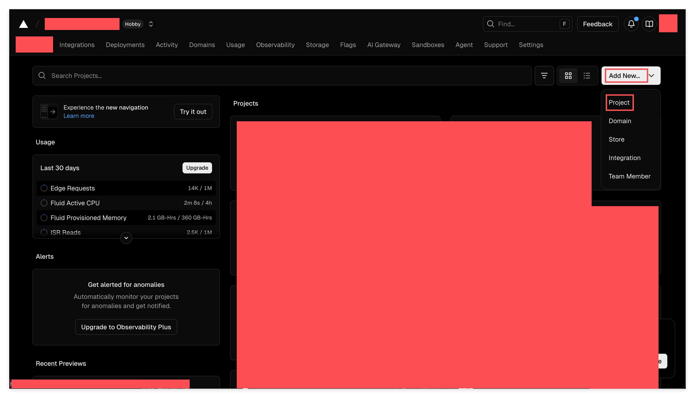
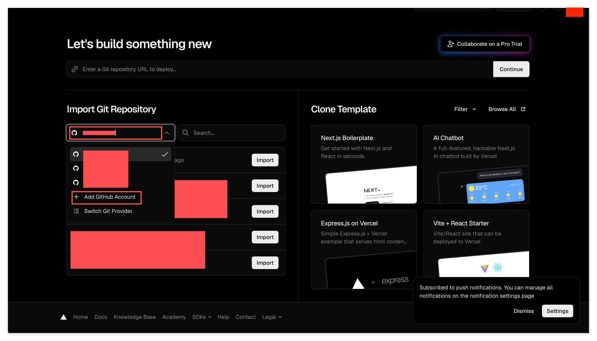
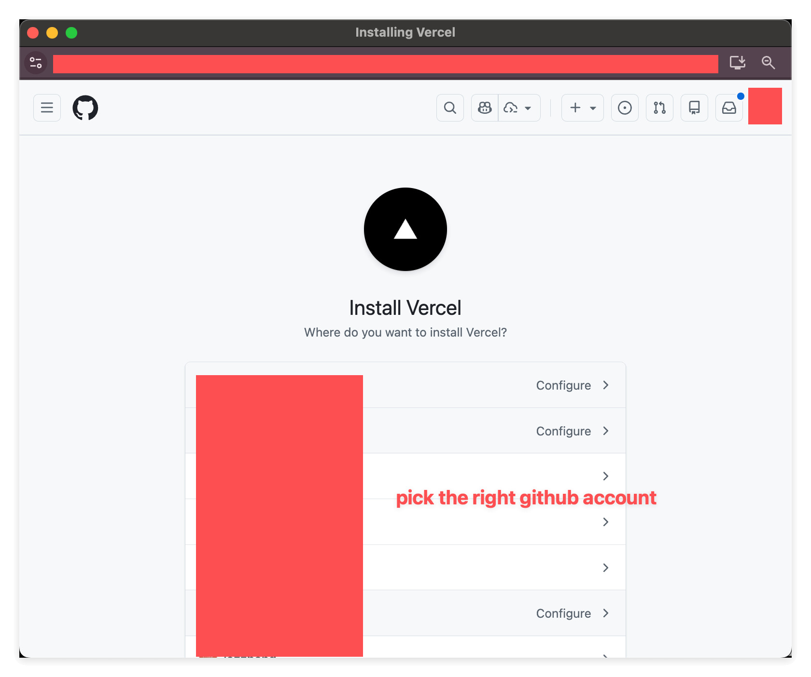
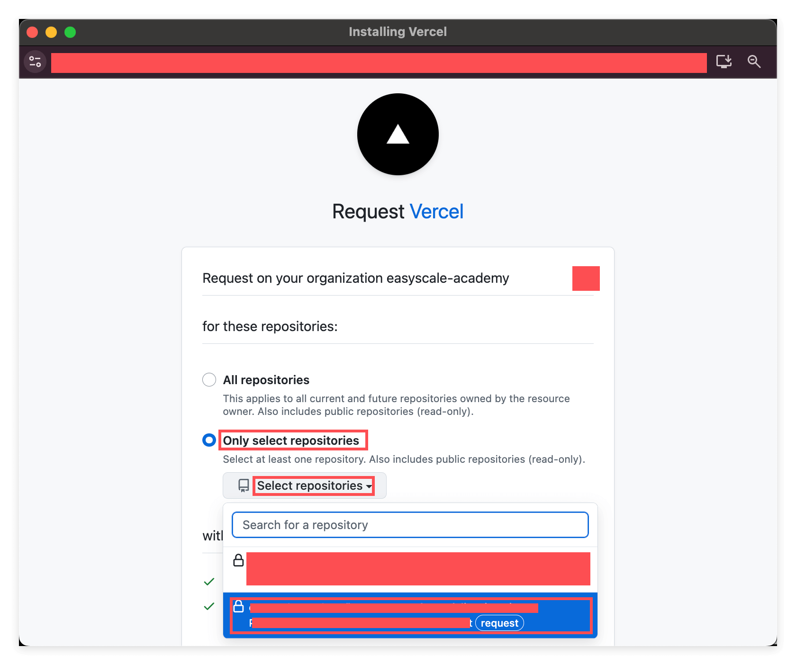
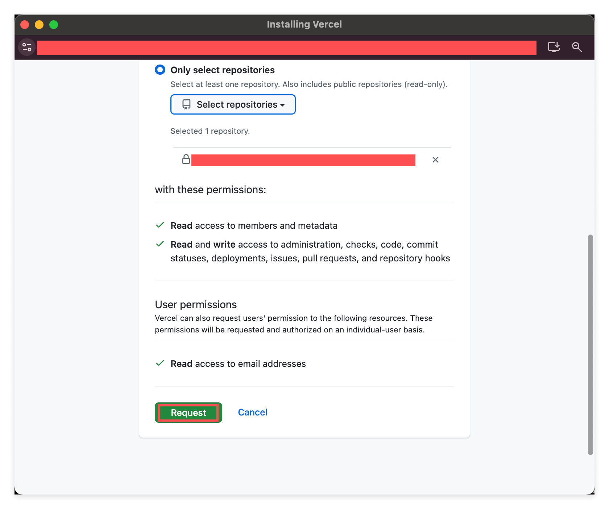
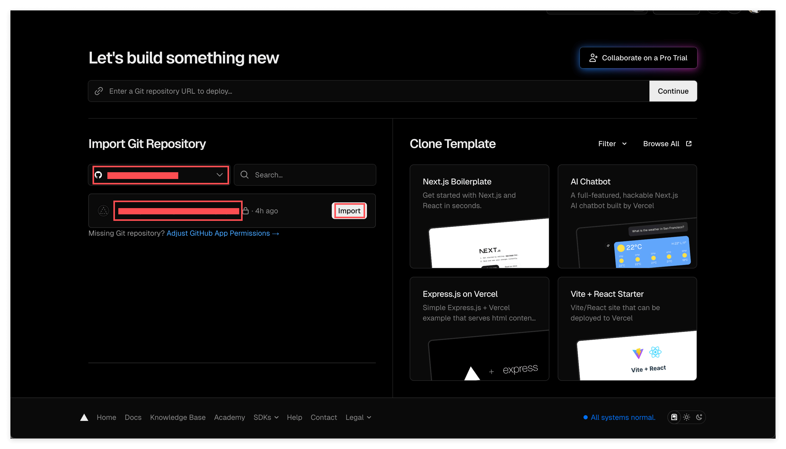
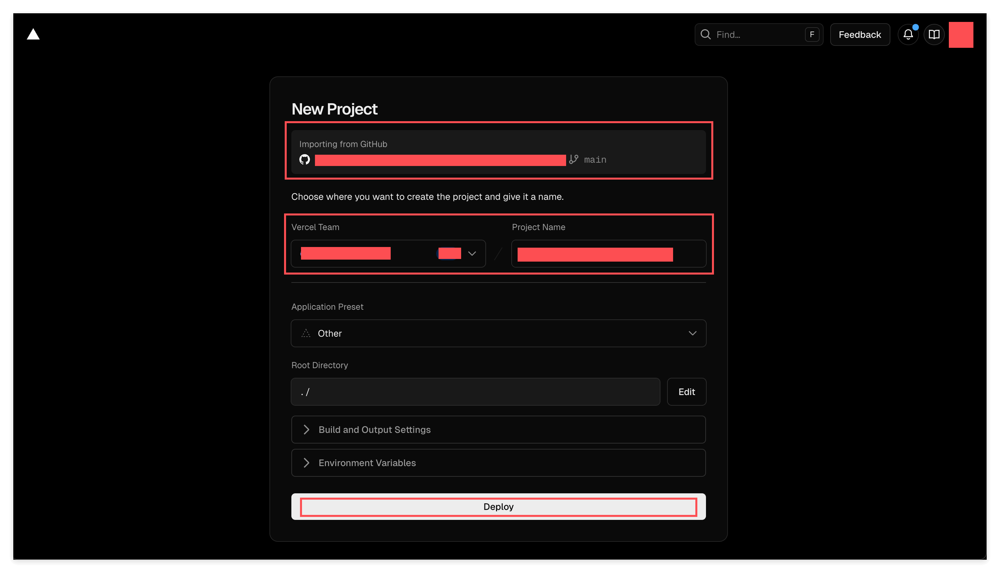
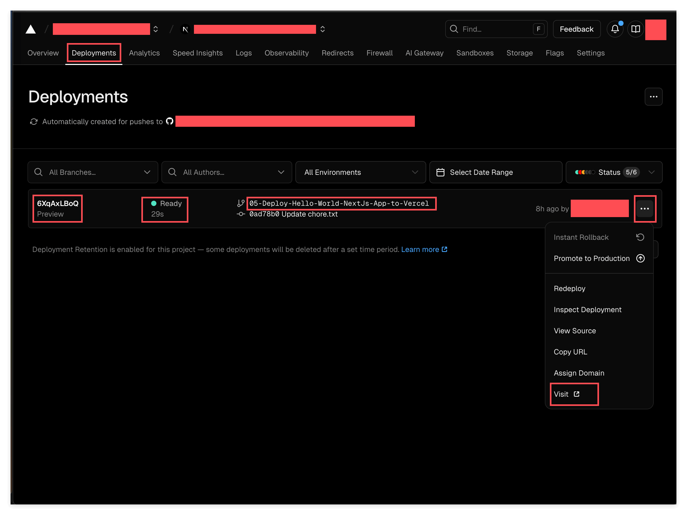
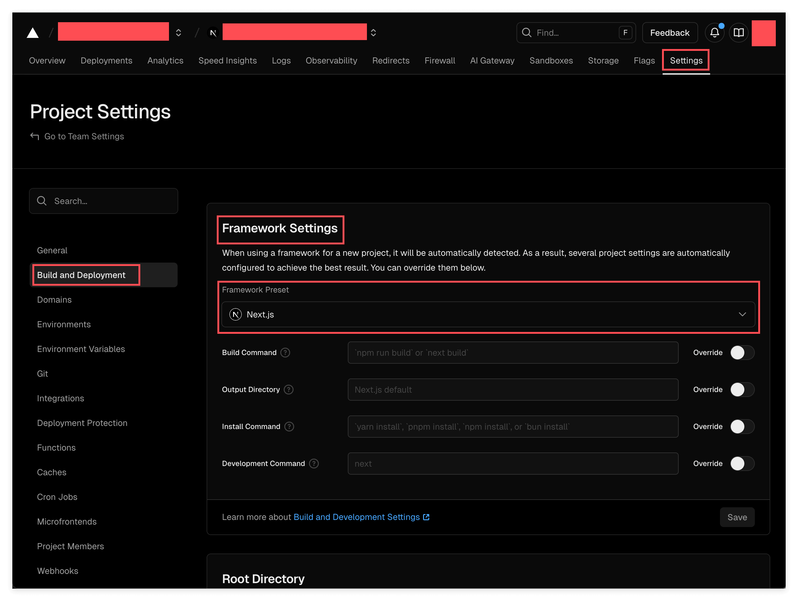

# Deploying Your Next.js + FastAPI App to Vercel

> Set up a deployment pipeline so you can instantly verify if your code changes build and deploy successfully.

## Overview

You've successfully run your Next.js + FastAPI full-stack application locally. Now it's time to deploy it to the cloud.

**Vercel** is a cloud platform optimized specifically for Next.js. Its key features:
- Extremely simple deployment (connect GitHub, auto-deploy)
- Free tier sufficient for personal projects
- Automatic redeployment on every code push

This tutorial will walk you through the entire deployment process. You don't need to change any code—just click through the Vercel interface.

---

## Learning Objectives

Deployment is a critical step in software development. Writing code is just the beginning—**enabling users to access your application** is where real value lies.

Many beginners imagine "deployment" as complex: buying servers, configuring domains, setting up SSL certificates, managing databases... But modern SaaS platforms (like Vercel) automate all of this. You just connect your GitHub repo, and they handle the rest.

Learning to use such platforms means you can quickly turn ideas into reality—finish your code, and minutes later the whole world can access it.

By the end of this exercise, you will:

1. Understand how Vercel integrates with GitHub
2. Complete the authorization binding between Vercel and GitHub accounts
3. Successfully deploy a Next.js application to the cloud
4. Learn to check deployment status and access deployed websites
5. Know how to debug when deployment fails

## Prerequisites

- You have a GitHub repository containing Next.js code
- You have registered a Vercel account (if not, go to [vercel.com](https://vercel.com) to sign up)
- Your code runs normally locally (`mise run dev` works)

## What You'll Build

After completing this tutorial, you'll have a working deployment pipeline:
- Every time you push code to your branch, Vercel automatically builds and deploys
- You can click "Visit" to see your preview deployment and verify it works
- This is **not** production (we're not promoting to main)—it's your personal verification that the code deploys correctly

Think of it as **TDD for deployment**: push → see if it builds → fix if needed → repeat. This rapid feedback loop is essential for modern development.

---

## Key Concepts

### What is Vercel?

Vercel is a **cloud platform** specifically for deploying web applications. Its founder is also the creator of Next.js, so Vercel has excellent Next.js support.

**How it works:**
1. You push code to GitHub
2. Vercel detects the code update
3. Vercel automatically builds your project
4. After successful build, automatically deploys to its servers
5. Your website is live

This process is called **CI/CD (Continuous Integration / Continuous Deployment)**—code commits trigger automatic build and deployment.

### GitHub App Authorization

For Vercel to read your GitHub repo, you need to authorize it. This is done by installing a **GitHub App**.

The authorization process lets you choose:
- **All repositories** - Vercel can access all repos under your account
- **Only select repositories** - Only allow access to specific repos you choose

For security reasons, we recommend selecting **Only select repositories**, authorizing only the projects you need to deploy.

### Branches and Deployments

Vercel monitors all branches of your GitHub repo:
- **main branch** - Usually serves as the Production environment
- **other branches** - Serve as Preview environments

Every time you push code to any branch, Vercel automatically creates a new deployment. This means you can test in Preview environments before merging to main.

### Framework Detection

When first importing a project, Vercel tries to automatically detect your framework (Next.js, React, Vue, etc.). If successful, it automatically configures the correct build commands and output directory.

If detection fails (e.g., your main branch code is incomplete), you need to manually set the Framework Preset in Settings.

---

## Exercises

### Exercise 1: Create New Project and Import Repository

**Goal:** Create a new project on Vercel and connect it to your GitHub repo.

**What to do:**

1. Log in to your Vercel Dashboard ([vercel.com/dashboard](https://vercel.com/dashboard))

2. In the top right corner, find the **"Add New..."** button, click it, then select **"Project"**

   

   As shown, click the "Add New..." dropdown menu, then select "Project".

3. You'll see the **"Let's build something new"** page. There are two ways to import a repo:

   

   **Option 1: Import from linked GitHub account**

   If you've previously linked a GitHub account, you'll see a dropdown menu in the "Import Git Repository" area listing your GitHub accounts. Expand the dropdown, find the repo you want to deploy, and click the **"Import"** button next to it.

   **Option 2: If you don't see your account**

   Click **"+ Add GitHub Account"** in the dropdown menu to add your GitHub account.

   **Option 3: Enter URL directly**

   If your repo is public, you can paste your GitHub repo URL in the input box "Enter a Git repository URL to deploy..." and click "Continue".

**What you'll notice:**

- Vercel's interface is clean and simple, core operations are obvious
- The "Clone Template" area on the right is for those who want to start quickly with a template—we don't need it

> **Key insight:** Vercel's design philosophy is "turn a GitHub repo into a living website". You put code on GitHub, Vercel turns it into an accessible service.

---

### Exercise 2: Authorize Vercel to Access Your GitHub (First-time Setup)

**Goal:** If this is your first time, authorize Vercel to access your GitHub account.

**What to do:**

1. After clicking "Add GitHub Account", you'll be redirected to GitHub's authorization page. The page title is **"Install Vercel"**.

   

   This page asks: **"Where do you want to install Vercel?"**

   As shown, you may see multiple options—your personal account and GitHub Organizations you've joined.

   **Important: Pick the right account!** If the repo you want to deploy is under your personal account, select your personal account. If it's under an Organization, select that Organization. The red annotation in the image reminds you to "pick the right github account".

2. Click the **"Configure >"** button next to the account you want to authorize.

3. Next, GitHub will ask which repositories you want to authorize:

   

   You'll see two options:
   - **All repositories** - Authorize all repos (convenient but less secure)
   - **Only select repositories** - Authorize only specific repos (recommended)

   As shown, we recommend selecting **"Only select repositories"**, then click the "Select repositories" dropdown, find your repo, and select it.

   **Why choose "Only select repositories"?**

   For security reasons—principle of least privilege. Enterprise projects typically don't authorize third-party services to access all code. While selecting "All repositories" is fine for personal projects, it's good to build secure habits.

4. After selecting the repo, scroll down to see Vercel's permission request:

   

   Permissions include:
   - **Read** access to members and metadata
   - **Read and write** access to administration, checks, code, commit statuses, deployments, issues, pull requests, and repository hooks

   These permissions allow Vercel to:
   - Read your code for building
   - Report deployment status on your repo
   - Automatically add preview links on PRs

   After confirming, click the green **"Request"** button.

5. **Wait for approval (if Organization)**

   If you authorized a personal account, authorization takes effect immediately.

   But if you authorized an Organization (like a company or school account), the Organization admin may need to approve. In this case:
   - You'll receive an email notification
   - The admin will receive an approval request
   - Authorization takes effect after admin approval

   If you're the admin yourself, go to your GitHub Settings > Applications > Authorized OAuth Apps or GitHub Apps to approve.

**What you'll notice:**

- GitHub's authorization page explains clearly what each permission is for
- Authorization can be revoked anytime (in GitHub Settings)

> **Key insight:** This authorization process is actually installing a "GitHub App". Vercel uses this App to monitor your code changes and trigger automatic deployments.

---

### Exercise 3: Return to Vercel to Complete Import

**Goal:** After authorization, return to Vercel to officially import your repo.

**What to do:**

1. After authorization, return to Vercel's "Let's build something new" page.

   

   You should now see your authorized repo in the "Import Git Repository" area.

   **Note:** Authorization just lets Vercel "see" your repo, but hasn't actually imported it. You need to click the **"Import"** button next to the repo to start the import process.

2. Click the **"Import"** button.

**What you'll notice:**

- If you just completed authorization but don't see the repo, refresh the page
- If still not visible, authorization may not have taken effect yet—wait a moment or check your GitHub email for approval requests

> **Key insight:** "Seeing the repo" and "importing the repo" are two steps. Many people think they're done after authorization, but you still need to come back and click Import.

---

### Exercise 4: Configure Project and Deploy

**Goal:** Set project configuration, then trigger your first deployment.

**What to do:**

1. After clicking Import, you'll see the **"New Project"** configuration page:

   

   This page lets you configure several key options:

   **Importing from GitHub**
   - Shows the repo name you're importing
   - Note the branch shown on the right (e.g., `main`). First import defaults to deploying from main branch.

   **Vercel Team**
   - Choose which team to deploy the project to. If you only have one personal account, only one option shows. If you've joined multiple teams (personal + company accounts), select the correct one.

   **Project Name**
   - Your project's name on Vercel. This affects your default URL (`https://[project-name].vercel.app`).

   **Application Preset / Framework Preset**
   - Vercel tries to auto-detect your framework. If it detects Next.js, this will show "Next.js".

   **Other options** (usually don't need to change)
   - Root Directory - Default is `./`
   - Build and Output Settings - Vercel auto-configures based on framework
   - Environment Variables - Add here if your project needs them

2. After confirming configuration, click the **"Deploy"** button at the bottom.

3. Vercel will start building your project. This usually takes 1-3 minutes. You can see real-time build logs on the page.

**What you'll notice:**

- After clicking Deploy, it changes to "Deploying..."
- You'll see build progress and logs
- If everything goes well, you'll see "Congratulations!" and your website URL

> **Key insight:** First deployment starts from the main branch. If your main branch code is incomplete, deployment may fail. Don't worry, we'll handle this situation next.

---

### Exercise 5: View Deployment Status and Visit Website

**Goal:** Learn to view the deployment list and how to access deployed websites.

**What to do:**

1. After deployment completes, enter your project Dashboard. Click the **"Deployments"** tab in the top navigation.

   

   This lists all deployments. Each row represents one deployment with the following information:

   - **Preview ID** (e.g., "6XqAxLBoQ") - Unique identifier for this deployment
   - **Status** (e.g., green "Ready") - Deployment status. Green Ready means success, red Error means failure
   - **Branch name** (e.g., "05-Deploy-Hello-World-NextJs-App-to-Vercel") - Which branch this deployment came from
   - **Commit message** (e.g., "Update chore.txt") - The commit that triggered this deployment

2. **Visit the deployed website:**

   On the right side of any row, click the **three dots ("...")** button to open a menu. Select **"Visit"** to open your deployed website in a new window.

   You can also click "Copy URL" to copy the link and share with others.

3. **Understanding different branch deployments:**

   Notice the highlighted parts in the image:
   - branch is `05-Deploy-Hello-World-NextJs-App-to-Vercel`
   - type is "Preview"

   This means this isn't the main branch (Production), but a preview deployment. Each non-main branch generates its own preview URL.

**What you'll notice:**

- Every time you push code to GitHub, Vercel automatically creates a new deployment
- Status changes from "Building..." to "Ready" or "Error"
- A project can have many deployments, all preserved in history

> **Key insight:** Vercel's automatic deployment mechanism enables rapid iteration. Change code → push → wait a few minutes → new version live. This is the rhythm of modern development.

---

### Exercise 6: Trigger a New Deployment

**Goal:** Learn how to manually trigger a new deployment.

**What to do:**

We're now going to verify Vercel's automatic deployment mechanism. The method is simple: modify a file, push to GitHub, then see if Vercel auto-deploys.

1. **Make sure you're on the correct branch:**

   ```bash
   git checkout 05-Deploy-Hello-World-NextJs-App-to-Vercel
   ```

   (or whatever branch you're currently developing on)

2. **Modify the `chore.txt` file:**

   This project has a `chore.txt` file—its content doesn't matter, it's specifically for triggering deployments. Open it, add some content (like a timestamp), then save.

   ```bash
   echo "Trigger deployment: $(date)" >> chore.txt
   ```

3. **Commit and push:**

   ```bash
   git add chore.txt
   git commit -m "Trigger deployment"
   git push
   ```

4. **Return to Vercel Dashboard's Deployments tab,** wait a few seconds, and you'll see a new deployment appear with "Building..." status.

5. **Wait for build to complete:**
   - If successful, status changes to green "Ready"
   - If failed, status changes to red "Error"

6. **Once successful, click "Visit" to access your website.**

**What you'll notice:**

- From push to deployment completion usually takes about 1 minute
- No manual operation needed—Vercel automatically detects GitHub changes
- Each push to any branch triggers an independent deployment

> **Key insight:** The purpose of `chore.txt` is: when you just want to test the deployment process without changing real code, you can modify it to trigger deployment. This is a common technique.

---

### Concept Deep-Dive: What is CI/CD?

What you just experienced—"push code → Vercel auto-deploys"—has a professional term in the industry: **CI/CD**.

- **CI (Continuous Integration)**: Every time you push code, the system automatically runs tests, checks for errors, and attempts to build. Problems are reported immediately, not discovered at deployment time.

- **CD (Continuous Deployment)**: After code passes all checks, it's automatically deployed to servers and the website updates immediately.

Traditional workflows require manual testing, manual building, manual server upload—potentially hours of work with high error rates. With CI/CD, the entire process takes under 2 minutes, fully automated.

**This is why GitHub changes trigger immediate Vercel responses**—it's automatically doing everything that used to be manual.

---

### Exercise 7: Handling Framework Detection Failure (Optional)

**Goal:** Learn how to manually configure when Vercel doesn't auto-detect the framework.

**Background:**

When first importing a project, Vercel reads code from the main branch to detect the framework. But if your main branch:
- Has incomplete code
- Doesn't have standard Next.js structure
- Is completely empty

Vercel may not detect it as a Next.js project. The build will fail.

**What to do:**

1. Enter your project Dashboard, click the **"Settings"** tab in the top navigation.

   

2. In the left menu, find and click **"Build and Deployment"**.

3. Find the **"Framework Settings"** area on the right.

4. Click the **"Framework Preset"** dropdown, select **"Next.js"** from the list.

5. Click the **"Save"** button at the bottom to save configuration.

6. Return to Deployments tab, find the previously failed deployment, click the three-dot menu, select **"Redeploy"**. Or use Exercise 6's method—modify `chore.txt` and push to trigger a new deployment.

7. This time it should succeed.

**What you'll notice:**

- Settings page has many options, most don't need changing
- Framework Preset determines how Vercel builds your project
- Once the correct framework is set, subsequent deployments use this configuration

> **Key insight:** This issue usually only occurs on first import. Once configured, you don't need to worry about it again. The key is knowing how to read build logs—they tell you what went wrong.

---

## Reflection: What Did We Learn?

After completing this tutorial, you learned:

**Vercel's core workflow:**
- GitHub repo → Vercel import → auto build → website live
- Every code push → automatic new deployment
- main branch → Production, other branches → Preview

**Key operations:**
- How to create a new project on Vercel
- How to authorize Vercel to access your GitHub
- How to check deployment status and build logs
- How to access deployed websites
- How to manually set Framework Preset

**Debug approach:**
- When deployment fails, first check build logs
- Verify Framework Preset is correct
- Screenshot or copy error messages for AI analysis

---

## Mentor's Note

**Why this exercise matters:**

Deployment is the final step in turning ideas into reality. Many excellent projects never leave the developer's computer because they were never deployed.

I've seen too many students spend weeks or even months writing code, but never let anyone actually use it. Code only has value when it's running and being used. Deployment is the bridge connecting "writing code" to "creating value".

Platforms like Vercel have simplified deployment to the extreme. What used to take operations engineers days to configure now takes minutes. This means as a developer, you can spend more time writing code and creating value instead of wrestling with servers.

**Key insights:**

- **Deployment isn't the end, it's the beginning** - Going live is just the start. User feedback, bug fixes, new feature iterations—that's the real work
- **Preview deployments are a superpower** - Each branch has its own preview URL, letting others see the effect before you merge
- **Automation is a productivity multiplier** - CI/CD looks like "auto-deployment", but it actually frees your mental energy to focus on creation

**Next steps:**

1. Try modifying some page content, push it, and see if Vercel updates correctly
2. Learn how to add Environment Variables—essential for deploying real applications
3. Explore Vercel's Analytics and Logs features to understand your website's traffic
4. Consider binding your own domain (Custom Domain)

---

## Quick Reference

**Vercel Dashboard URL:**
```
https://vercel.com/dashboard
```

**Trigger new deployment (without code changes):**
```bash
echo "$(date)" >> chore.txt
git add chore.txt && git commit -m "Trigger deployment" && git push
```

**Check current branch:**
```bash
git branch --show-current
```

**Key files:**
- `chore.txt` - Placeholder file for triggering deployments, content doesn't matter

---

## Troubleshooting

**Issue: Can't see repo after authorization**
- Refresh the Vercel page
- Check if you authorized the correct GitHub account/Organization
- If Organization, check if admin has approved

**Issue: Build failed**
- Click the failed deployment, view Build Log
- Check Settings > Build and Deployment > Framework Preset is set to Next.js
- Screenshot or copy error log for AI analysis

**Issue: Deployment succeeded but page displays incorrectly**
- Confirm you pushed to the correct branch
- Check if preview URL corresponds to the correct deployment
- Check Browser Console (F12) for errors

**Issue: Don't know how to get back to Vercel page**
- Go directly to https://vercel.com/dashboard
- All your projects are there

---

## Reference Implementation

The complete code for this tutorial is in the `05-Deploy-Hello-World-NextJs-App-to-Vercel` branch.

To test locally:

```bash
git checkout 05-Deploy-Hello-World-NextJs-App-to-Vercel
mise run inst
mise run dev
```

Then open http://localhost:3000 to confirm it runs locally before deploying to Vercel following this tutorial.
