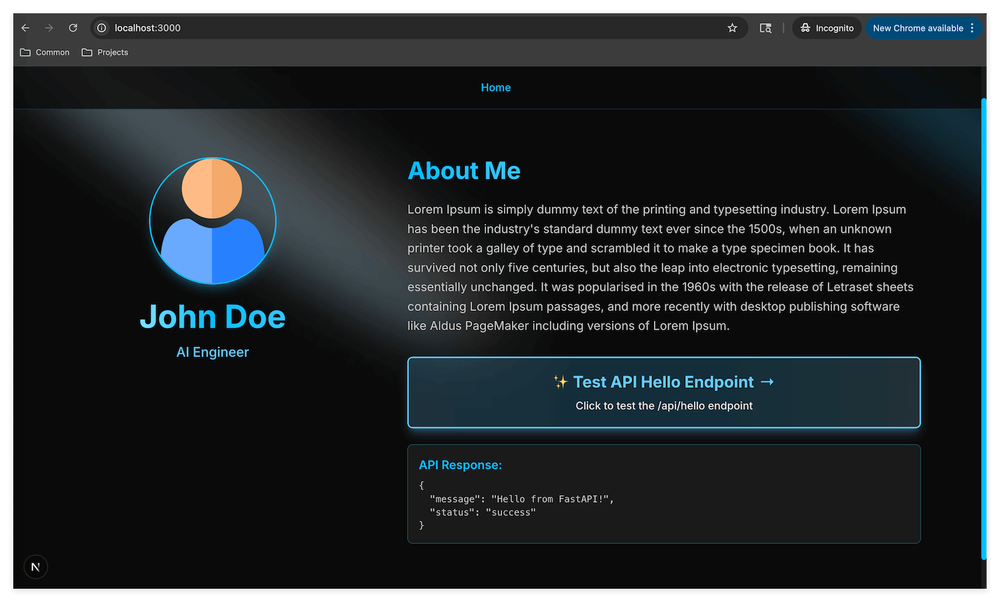

# Exploring a Codebase: Top-Down Learning Method

> Learn how to navigate unfamiliar code by starting from what you can see (UI) and tracing back to the source.



## Overview

You've got the app running locally. Now what?

Most tutorials stop here. They show you how to run the code, maybe explain what each file does, and move on. But that's like giving you a map without teaching you how to read it.

This tutorial is different. Instead of telling you where things are, we'll teach you **how to find them yourself**. This is a skill that transfers to any codebase, any framework, any language.

## Learning Objectives

When you join a new team or start working on an unfamiliar project, you'll face codebases with hundreds or thousands of files. Nobody will hand you a map. You need to be able to explore on your own.

The developers who advance fastest aren't the ones who memorize file locations—they're the ones who can efficiently navigate any codebase they encounter. This exploration skill is what separates junior developers who always need guidance from senior developers who can onboard themselves.

By the end of this exercise, you will:

1. Understand the Top-Down learning approach and why it's effective
2. Learn three practical techniques for finding code from UI elements
3. Practice tracing UI elements back to their source code
4. Build the mental muscle for self-directed codebase exploration

## Prerequisites

- You have completed the previous tutorial and can run `mise run dev` successfully
- You have a browser and can access http://localhost:3000
- You have an AI assistant available (Claude, ChatGPT, etc.)

## What You'll Build

Nothing. You won't write any code in this tutorial.

Instead, you'll build something more valuable: **the ability to explore any codebase confidently**. By the end, you'll know exactly which file creates each element on the screen, and more importantly, you'll know how to find this information yourself in any project.

---

## Key Concepts

### What is Top-Down Learning?

**Top-Down learning** means starting from what you can see and working backwards to understand how it's built.

Instead of:
- Reading all the files from top to bottom
- Memorizing the project structure
- Following a linear tutorial

You do:
- See something on screen → ask "where does this come from?"
- Find the answer → ask "how does this get loaded?"
- Keep tracing → until you reach the entry point

This approach is effective because:
- You learn with immediate context (you can see what you're studying)
- You only learn what's relevant (no wasted time on unused code)
- You build a mental map naturally (connections, not isolated facts)

### The Alternative: Bottom-Up Learning

**Bottom-Up learning** means starting from the foundation and building up understanding layer by layer.

For example:
- Read the project structure documentation
- Study the configuration files
- Understand the build process
- Then look at the components

Both approaches have their place. Top-Down is great for quick exploration and understanding "what does this thing do?" Bottom-Up is better when you need deep understanding of a system's architecture.

**In this tutorial, we focus on Top-Down** because it's the skill most beginners lack, and it's the fastest way to become productive in a new codebase.

### Three Techniques for Finding Code

When you see something on screen and want to find its source code, you have three main approaches:

**Technique 1: Text Search**

If the UI element contains visible text, search for that exact text in the codebase.

Example: You see "About Me" on screen → search for `"About Me"` in the code

This is the simplest and most reliable method when text is available.

**Technique 2: Browser DevTools**

If there's no searchable text (like an image or icon), use Chrome DevTools to inspect the element and find identifying information.

Example: You see a profile image → right-click, Inspect → find class names, IDs, or src attributes → search for those

**Technique 3: Screenshot to AI**

When other methods fail, take a screenshot, highlight the element you're curious about, and ask an AI assistant.

Example: "I see this button (circled in red). What file in my codebase creates this?"

This is especially useful when you're not sure what to search for.

---

## Exercises

### Exercise 1: Start the Application

**Goal:** Get the app running and identify all the UI elements we'll trace.

**What to do:**

1. Open your terminal and run:
   ```bash
   mise run dev
   ```

2. Open http://localhost:3000 in your browser

3. Look at the screen and identify these elements:
   - The "Home" link in the navigation bar
   - The profile picture (avatar)
   - The name "John Doe" and title "AI Engineer"
   - The "About Me" heading
   - The paragraph of Lorem Ipsum text
   - The "Test API Hello Endpoint" button
   - The API Response area (appears after clicking the button)

**What you'll notice:**

You're looking at a simple portfolio page. Every single element you see is created by code somewhere in this project. Your mission is to find that code.

> **Key insight:** Before searching for code, take a moment to really look at what's on screen. What text do you see? What could you search for?

---

### Exercise 2: Find the "Home" Navigation Link

**Goal:** Practice Technique 1 (Text Search) to find where the "Home" link is defined.

**What to do:**

1. Look at the navigation bar. You see the word "Home".

2. **Try it yourself first:** Before reading further, try to find where this "Home" text is defined in the codebase. Use your editor's search function or `grep`.

3. **Stuck?** Here's how to do it: Search for the exact string `"Home"` in the project. You're looking for where this label is defined, not where it's rendered.

4. Once you find the file, read the surrounding code. Try to understand:
   - How is the navigation structure defined?
   - How does this become a clickable link?
   - How does this component get loaded into the page?

**The answer (only read after trying yourself):**

The "Home" link is defined in `app/_components/layouts/Navigation.tsx`:

```typescript
const DEFAULT_NAV_ITEMS: NavItem[] = [
  { label: "Home", href: "/" },
]
```

**Tracing the import chain:**

1. `Navigation.tsx` exports a `Navigation` component
2. `app/(marketing)/layout.tsx` imports and uses `<Navigation />`
3. This layout wraps all pages in the `(marketing)` route group
4. When you visit `/`, Next.js renders `layout.tsx` which includes `Navigation`

> **Key insight:** The text you see on screen often appears as a string literal in the code. Searching for exact strings is usually the fastest way to find UI code.

---

### Exercise 3: Find the Profile Picture (Hero Image)

**Goal:** Practice Technique 2 (DevTools) when text search isn't obvious.

**What to do:**

1. Look at the circular profile picture on the left side of the page.

2. There's no text to search for. So let's try DevTools.

3. Right-click on the image → click "Inspect" (or press F12)

4. In the Elements panel, you'll see the HTML for this image. Look for:
   - The `src` attribute (where does the image come from?)
   - Any class names that might be searchable

5. **Try it yourself:** What file path or class name do you see? Search for it.

**The answer (only read after trying yourself):**

In DevTools, you'll see something like:
```html

```

Search for `profile.png` or `John Doe Profile Photo` in the codebase.

You'll find it in `app/(marketing)/_components/Hero.tsx`:

```tsx
<Image
  src="/images/profile.png"
  alt="John Doe Profile Photo"
  width={192}
  height={192}
  className="w-full h-full object-cover"
/>
```

**Tracing the import chain:**

1. `Hero.tsx` exports a `Hero` component
2. `app/(marketing)/HomePageContent.tsx` imports `<Hero />`
3. `app/(marketing)/page.tsx` imports `<HomePageContent />`
4. When you visit `/`, Next.js renders `page.tsx`

> **Key insight:** DevTools is your X-ray vision. When you can't search by text, inspect the HTML and search by attributes, class names, or file paths.

---

### Exercise 4: Find "John Doe" and "AI Engineer"

**Goal:** Reinforce Technique 1 with multiple related elements.

**What to do:**

1. You see "John Doe" (large text) and "AI Engineer" (smaller, highlighted text) below the profile picture.

2. **Try it yourself:** Search for these strings in the codebase.

3. Notice that both are in the same file. What does this tell you about the component structure?

**The answer (only read after trying yourself):**

Both are in `app/(marketing)/_components/Hero.tsx`:

```tsx
<h1 className="...">
  John Doe
</h1>
<p className="...">
  <span className="text-highlight">AI Engineer</span>
</p>
```

**What this reveals:**

The `Hero` component is responsible for the entire left-side profile area: the image, name, and title. This is a common pattern—grouping related UI elements into a single component.

> **Key insight:** When you find one element, look around in the same file. Related elements are often nearby.

---

### Exercise 5: Find the "About Me" Section

**Goal:** Practice finding headings and their associated content.

**What to do:**

1. You see the "About Me" heading in cyan/teal color on the right side.

2. **Try it yourself:** Search for this text and find where it's defined.

3. Also find where the Lorem Ipsum paragraph text is defined.

**The answer (only read after trying yourself):**

Both are in `app/(marketing)/_components/Hero.tsx`:

```tsx
<h2 className="...">
  About Me
</h2>

<p className="text-lg text-text-secondary mb-8 leading-relaxed">
  Lorem Ipsum is simply dummy text of the printing and typesetting industry...
</p>
```

**Notice the structure:**

The `Hero` component contains both the left column (profile) and the right column (about text). It's a two-column layout within a single component.

> **Key insight:** Component boundaries don't always match visual boundaries. One component can manage multiple visual sections.

---

### Exercise 6: Find the "Test API Hello Endpoint" Button

**Goal:** Find interactive elements and understand their behavior.

**What to do:**

1. Look at the clickable button that says "Test API Hello Endpoint".

2. **Try it yourself:** Search for this text in the codebase.

3. Once you find the button, look for:
   - What happens when you click it? (Look for `onClick`)
   - What function does it call?
   - What API endpoint does it hit?

**The answer (only read after trying yourself):**

In `app/(marketing)/_components/Hero.tsx`:

```tsx
<button
  onClick={handleApiCall}
  disabled={isLoading}
  className="..."
>
  ...
  {isLoading ? "Loading..." : "Test API Hello Endpoint"}
  ...
</button>
```

The `handleApiCall` function:

```tsx
const handleApiCall = async () => {
  setIsLoading(true)
  try {
    const response = await fetch("/api/hello")
    const data = await response.json()
    setApiResponse(JSON.stringify(data, null, 2))
  } catch (error) {
    setApiResponse("Error fetching API response")
  } finally {
    setIsLoading(false)
  }
}
```

> **Key insight:** For interactive elements, finding the element is just step one. The real understanding comes from tracing what happens when you interact with it.

---

### Exercise 7: Find the API Endpoint

**Goal:** Trace from frontend to backend code.

**What to do:**

1. From Exercise 6, you know the button calls `/api/hello`.

2. **Try it yourself:** Where is this API endpoint defined? Search for `"/api/hello"` or `@app.get` or similar API decorators.

3. **Hint:** This project uses FastAPI for the backend. The API code isn't in the `app/` folder—look elsewhere.

**The answer (only read after trying yourself):**

The API is defined in `api/index.py`:

```python
@app.get("/api/hello")
async def hello_world():
    return JSONResponse(
        content={
            "message": "Hello from FastAPI!",
            "status": "success"
        }
    )
```

**But wait—how does Next.js know to route `/api/hello` to FastAPI?**

Check `next.config.js`:

```javascript
rewrites: async () => {
  return [
    {
      source: "/api/:path*",
      destination:
        process.env.NODE_ENV === "development"
          ? "http://127.0.0.1:8000/api/:path*"
          : "/api/",
    },
    ...
  ];
},
```

This tells Next.js: "When someone requests `/api/anything`, forward it to FastAPI running on port 8000."

> **Key insight:** Modern applications often have multiple services communicating. Tracing a request might lead you across service boundaries.

---

### Exercise 8: Ask AI to Find Something (Technique 3)

**Goal:** Practice using AI as an exploration tool.

**What to do:**

1. Take a screenshot of the running application.

2. Draw a red circle around any element you're curious about.

3. Ask your AI assistant: "In my Next.js + FastAPI project, which file creates [describe the circled element]?"

4. **Example prompts you can try:**

   - "I circled the navigation bar at the top. Which file creates this?"
   - "I circled the glowing effect behind the profile. Where does this come from?"
   - "I circled the API response box. Which component handles displaying this?"

**What you'll notice:**

AI can often identify components just from visual description. This is especially useful when:
- You don't know the right terms to search for
- The element is created dynamically
- You want to understand how multiple pieces fit together

> **Key insight:** AI is a power-multiplier for exploration. Don't hesitate to ask "dumb" questions—the goal is learning, not appearing smart.

---

## Reflection: What Did We Learn?

After completing these exercises, you've learned:

**The Top-Down approach:**
- Start from what you can see (the UI)
- Ask "where does this come from?"
- Trace backwards to the source code
- Keep following imports until you understand the full chain

**Three practical techniques:**
- Text Search: Search for visible strings in the codebase
- DevTools: Inspect elements to find searchable attributes
- AI Assistant: Screenshot and ask when other methods fail

**How this project is structured:**
- `app/layout.tsx` is the root layout (applies to all pages)
- `app/(marketing)/layout.tsx` adds navigation to marketing pages
- `app/(marketing)/page.tsx` is the home page entry point
- `app/(marketing)/HomePageContent.tsx` is the main content
- `app/(marketing)/_components/Hero.tsx` contains most UI elements
- `app/_components/layouts/Navigation.tsx` creates the nav bar
- `api/index.py` handles API endpoints
- `next.config.js` configures routing between Next.js and FastAPI

**Most importantly:**
- Knowing "how to find" is more valuable than knowing "where it is"
- This skill transfers to any codebase, any framework
- The more you practice exploration, the faster you become

---

## Mentor's Note

**Why this exercise matters:**

I've seen many developers struggle when joining new projects. They wait for someone to explain the codebase, or they read documentation that's often outdated. The developers who thrive are those who can explore and learn independently.

This Top-Down skill isn't just for code. It's a fundamental learning approach that works for:
- Learning a new product (start using it, then dig into how it works)
- Understanding a new business (see the customer experience, then trace the processes)
- Debugging problems (see the symptom, then trace to the cause)

**Key insights:**

- **The best map is the one you draw yourself.** When you trace through code by hand, you build a mental model that no documentation can provide.

- **Don't be afraid to ask "dumb" questions.** AI assistants are judgment-free. Use them liberally when exploring. The goal is learning, not looking smart.

- **Top-Down and Bottom-Up complement each other.** Use Top-Down to quickly understand what's relevant. Use Bottom-Up when you need deep, systematic understanding. Master both.

**Next steps:**

1. Try the same exploration technique on a different project
2. When you encounter a bug, use Top-Down to trace from symptom to cause
3. Practice explaining code paths to others—teaching reinforces learning

---

## Quick Reference

**Start the development server:**
```bash
mise run dev
```

**Search for text in the codebase:**
```bash
# Using grep
grep -r "search text" --include="*.tsx" --include="*.ts"

# Using your editor's search (Cmd+Shift+F in VS Code)
```

**Key files in this project:**

- `app/layout.tsx` - Root layout, applies to all pages
- `app/(marketing)/layout.tsx` - Marketing pages layout with navigation
- `app/(marketing)/page.tsx` - Home page entry point
- `app/(marketing)/HomePageContent.tsx` - Main content component
- `app/(marketing)/_components/Hero.tsx` - Profile and about section
- `app/_components/layouts/Navigation.tsx` - Navigation bar
- `api/index.py` - FastAPI backend endpoints
- `next.config.js` - Next.js configuration including API rewrites

---

## Reference Implementation

This tutorial is designed for the `06-Explore-Codebase-Top-Down` branch.

To verify your environment is set up correctly:

```bash
git checkout 06-Explore-Codebase-Top-Down
mise run inst
mise run dev
```

Then open http://localhost:3000 and follow the exercises above.
